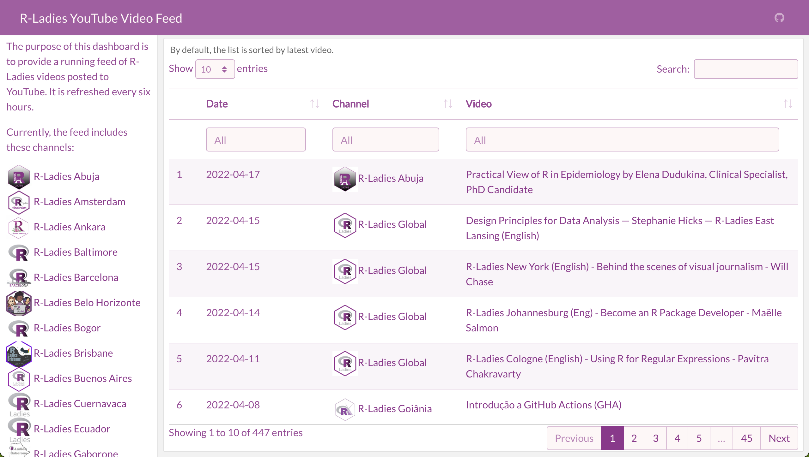

{fig-alt="A group of people around a camera in a bright, colorful room"}

[R-Ladies](https://rladies.org/) hosts an amazing number of Meetups. It is so inspiring and exciting to learn from R users from around the globe. However, due to work, time zones, or other commitments, I am unable to attend all of the events. Thankfully, since the pandemic began, hosts have started to record webinars and post them online. This provides a great opportunity to catch up on things I've missed afterward.

R-Ladies also have a variety of YouTube channels. The [R-Ladies Global](https://www.youtube.com/channel/UCDgj5-mFohWZ5irWSFMFcng) channel has the most videos, but local chapters often have their own account. I wanted an easy way to see all the videos from all the chapters I could find at once. I also wanted to search by presenter, topic, etc.

So, I set out to build a [flexdashboard](https://pkgs.rstudio.com/flexdashboard/) that would display all this information for me. Since flexdashboard is built on R Markdown, I could use custom colors and styles. Finally, I used [GitHub Actions](https://github.com/features/actions) to refresh the list every few hours. You can find it here: [https://ivelasq.github.io/rladies-video-feed/](https://ivelasq.github.io/rladies-video-feed/).

This post will walk through how I created it. The code for the dashboard is on [GitHub](https://github.com/ivelasq/rladies-video-feed) in case you want to reuse it with another set of channels!

:::{.callout-warning}
## YouTube RSS vs. YouTube API
I originally used the [tidyRSS](https://robertmyles.github.io/tidyRSS/) package to pull the videos from YouTube. However, the YouTube RSS feed limits results to the latest 15 videos. The code is still available in the repo if you would like to take a look. This is a good option if you only want the most recent stream of content and do not want to set up Google credentials. Thanks to the [R4DS channel](http://r4ds.io/join) and [Tom Mock](https://twitter.com/thomas_mock) for pointing me in the right direction!
:::

## Get Google credentials

As is often the case with anything to do with Google, first you must get credentials.

1. Create a [new project](https://console.cloud.google.com/projectcreate)
2. Go to [APIs & Services](https://console.cloud.google.com/apis/credentials
) and click "Credentials"
3. At the top, click "Create Credentials" and choose "OAuth client ID"
  - If it's your first time, you have to configure consent
  - I had to choose "External" on the consent screen
  - Give your app a name, an email, and a developer contact email
  - Go back to Credentials, click "Create Credentials" and choose "OAuth client ID"
4. Choose Web application and give your ID a descriptive name
  - I also had to add a redirect URI so that I could preview the app on my computer (what you see when you render the flexdashboard), it looks like `https://localhost:4321/`. If you get a `400` error when you try to authenticate tuber later, you may have to do the same.
5. Your Client ID and Client Secret will pop up. I saved these in my R environment so I didn't have to include them in my code. ^[You can do this by running `usethis::edit_r_environ` and adding two rows with `YOUTUBE_CLIENT_ID=num1` and `YOUTUBE_CLIENT_SECRET=num2`, then restarting your R session.]

## Pull and clean data

Woohoo, you are credentialed! It's time for the fun part --- pulling and cleaning data. I did this in a script called `data_processing.R`.

I used the [tuber](https://soodoku.github.io/tuber//index.html) package to access the YouTube API with R. Here are other packages that will aid you in your cleaning process:

``` R
library(tuber)
library(readr)
library(dplyr)
library(stringr)
library(DT)
```

Create a spreadsheet with the channels you are interested in. I created this manually (I just searched on YouTube to find all the R-Ladies channels I could). I tried to do as many things as programmatically as possible, so I only included the name of the chapter, its thumbnail, and the channel ID.

``` R
dat <-
  read_csv("https://github.com/ivelasq/rladies-video-feed/blob/main/r-ladies_channels.csv")
  
head(dat)
```

```
  chapter            image                                              id   
  <chr>              <chr>                                              <chr>
1 R-Ladies Global    https://yt3.ggpht.com/ytc/AKedOLRM4FPiPcPBdFUmYWR… UCDg…
2 R-Ladies Baltimore https://yt3.ggpht.com/RQifC3qp_7AFeTc48-QV1i4WBNM… UC9U…
3 R-Ladies Philly    https://yt3.ggpht.com/ytc/AKedOLShIKBvPUKqbvm_Cpu… UCPq…
4 R-Ladies STL       https://yt3.ggpht.com/ytc/AKedOLSBA7rlz1yvbIJ7TVN… UCQ7…
5 R-Ladies Sydney    https://yt3.ggpht.com/ytc/AKedOLQnaU-dJbb14j2RE6W… UCkr…
6 R-Ladies Vancouver https://yt3.ggpht.com/3yf0Zo8-VKffrG-dRT_Gs85xX_x… UCX5…
```

:::{.callout-warning}
## YouTube Channel IDs
Some YouTube channels have 'custom IDs' like RLadiesGlobal. These won't work in tuber, you need the original IDs. The best way I found to get this ID is to click on a video from a channel. Then, scroll down to the description and click the channel name from that video. Then it will appear in the URL after `/channel/`. A good idea for a future Shiny app would be a way to pull this information from the YouTube API...
:::

Now, create a few more columns with `dplyr::mutate()` that expand the URLs into HTML format:

``` R
dat_urls <-
  dat %>%
  dplyr::mutate(
    feed = paste0("https://www.youtube.com/feeds/videos.xml?channel_id=", id),
    feed_url = paste0("yt:channel:", id),
    channel_image_url = paste0(
      "</img>",
      " <a href='https://www.youtube.com/channel/",
      id,
      "' target='_blank'>",
      chapter,
      "</a><br>"
    ),
  )
```

Pull in the credential info that had you going through all those hoops earlier by using the tuber package (finally!).

``` R
yt_oauth(
  app_id = Sys.getenv("YOUTUBE_CLIENT"),
  app_secret = Sys.getenv("YOUTUBE_CLIENT_SECRET")
)
```
You may see the message below and have to type in a `1` to open an authentication window (be sure to read and follow the instructions in the console). 

``` bash
Use a local file ('.httr-oauth'), to cache OAuth access credentials between R sessions?

1: Yes
2: No
```

:::{.callout-warning}
## Error: HTTP failure: 401

Sometimes, you may be running your script with no problems and then all of the sudden, you get a 401 error. This is a [known issue](https://github.com/soodoku/tuber/issues/30) and the only solution I found was to delete the `.httr-oauth` file and then re-authenticate following the directions above.
:::

Great, now you have access to YouTube data!
The [documentation](https://soodoku.github.io/tuber/reference/index.html
) describes the many functions available to you. Since I had only the channel IDs, I wanted to use `list_channel_videos()` to get a full list of videos from the channels.

For example, for the R-Ladies Global channel, you could run to get its (currently 140) videos:

``` R
list_channel_videos("UCDgj5-mFohWZ5irWSFMFcng", max_results = 200)
```

What if you want the results for all the channels you have in our spreadsheet? I used a loop for this. This loop says: Starting with an empty data frame called `dat_videos` , for each row in `dat_urls` (which contains the channel IDs), find the channel ID, pull it out, run it through `list_channel_videos`, and then add the information as a row to `dat_videos`.

``` R
dat_videos <- NULL

for (i in 1:nrow(dat_urls)) {
  tmp <-
    dat_urls[i, ]["id"] %>%
    pull() %>%
    list_channel_videos(.,
                        part = "snippet",
                        config = list('maxResults' = 200))
  
  dat_videos <- bind_rows(dat_videos, tmp)
}
```

The arguments in `list_channel_videos` give me all the columns I am interested in with `part = "snippet"`. Notice that there's a default limit for the number of videos pulled from the API. I bumped that up a bit with the `maxResults` argument.

Then, I brought back the URL info:

``` R
dat_join <-
  dat_videos %>%
  left_join(., dat_urls, by = c("snippet.channelId" = "id"))
```

This results in a **lot** of information for each video. I cleaned it up a little bit so that the data frame only contained the columns I was interested in and were in HTML format.

``` R
dat_dashboard_dat <-
  dat_join %>%
  mutate(
    video_url = paste0(
      "<a href='https://www.youtube.com/watch?v=",
      snippet.resourceId.videoId,
      "' target='_blank'>",
      snippet.title,
      "</a>"
    ),
    channel_url = paste0(
      "</img>",
      "<a href='https://www.youtube.com/channel/",
      snippet.channelId,
      "' target='_blank'>",
      chapter,
      "</a>"
    ),
    date = as.Date(str_sub(snippet.publishedAt, 1, 10))
  ) %>%
  arrange(desc(snippet.publishedAt)) %>%
  select(date, chapter, channel_url, video_url, channel_image_url)
```

See the [final data processing file on GitHub](https://github.com/ivelasq/rladies-video-feed/blob/main/data-processing.R).

## Create a flexdashboard

You have the YouTube data --- time to create a pretty dashboard!

My flexdashboard started as R Markdown files often do: with a YAML header. I specified an orientation (columns) and added the link to the GitHub repository in the navigation bar.

``` YAML
---
title: "R-Ladies YouTube Video Feed"
output: 
  flexdashboard::flex_dashboard:
    orientation: columns
    navbar:
      - { icon: "fa-github", href: "https://github.com/ivelasq/rladies-video-feed", align: right }
---
```

### Add customization

If you'd like your dashboard to have a custom look, the [bslib](https://rstudio.github.io/bslib/) package is a great option. Ir can add different colors and fonts all from the YAML header. Make sure to add `library(bslib)` in the actual code part of your `.Rmd` file. I used the R-Ladies style guide to fill out the rest of the YAML header:

``` YAML
---
title: "R-Ladies YouTube Video Feed"
output: 
  flexdashboard::flex_dashboard:
    orientation: columns
    navbar:
      - { icon: "fa-github", href: "https://github.com/ivelasq/rladies-video-feed", align: right }
    theme:
      bg: "#FDF7F7"
      fg: "#88398A" # purple
      primary: "#88398A" # purple
      base_font:
        google: "Lato"
      code_font:
        google: "Inconsolata"
---
```

### Add packages for the dashboard

After the YAML header, add the packages you need. I used `source()` to read in the `data-processing.R` script.

``` R
library(flexdashboard)
library(bslib)
source("data-processing.R", local = knitr::knit_global())
```

## Fill out the dashboard

This dashboard was simple: just a sidebar and the main section. I recommend checking out the flexdashboard documentation to see all the [layout options](https://pkgs.rstudio.com/flexdashboard/articles/layouts.html) available to you.

This code builds out the sidebar section. I created a list of each R-Ladies chapter that I was able to find and arranged them by name. With `shiny::HTML()`, the dashboard can render the URLs as HTML (the reason for all that manipulation earlier on).

```` R
Sidebar {.sidebar}
-----------------------------------------------------------------------

The purpose of this dashboard is to provide a running feed of R-Ladies videos posted to YouTube. It is refreshed every six hours.

Currently, the feed includes these channels:

```{r}
dat_join %>% 
  arrange(chapter) %>% 
  distinct(channel_image_url) %>% 
  pull() %>% 
  shiny::HTML()
```
````

For the main body, I used the [DT](https://rstudio.github.io/DT/) package to create a table for the information in our clean dataset. I added a bit of HTML to make it expand to the entire column height.

A couple of fun tricks to notice:

* `escape = FALSE` renders the URLs within the table as HTML
* The list within `options` aligns the text within columns (in this case, to be in the middle of the cell for all columns)^[I found out about this here: [https://stackoverflow.com/questions/35749389/column-alignment-in-dt-datatable](https://stackoverflow.com/questions/35749389/column-alignment-in-dt-datatable).]

There are a lot of customization options!

```` R
Column {data-width=900}
-----------------------------------------------------------------------

### By default, the list is sorted by latest video.

<style>
.dataTables_scrollBody {
    max-height: 100% !important;
}
</style>

```{r}
dat_dashboard_dat %>%
  select(-chapter,-channel_image_url) %>%
  datatable(
    colnames = c('Date', 'Channel', 'Video'),
    filter = 'top',
    escape = FALSE,
    height = '1000',
    options = list(columnDefs = list(
      list(className = 'dt-middle', targets = "_all")
    ))
  )
```
````

And that's it! See the [final dashboard code](https://github.com/ivelasq/rladies-video-feed/blob/main/index.Rmd) on GitHub.

{fig-alt="Screenshot of the final dashboard with a sidebar of the R-Ladies channels and the main section showing the table of videos from the various chapters"}

[Try it out](https://ivelasq.github.io/rladies-video-feed/) --- search "Shiny" to see any video with Shiny in the title, or "Ecuador" to see all the videos from R-Ladies Ecuador!

## Schedule updates

I am glad to have a dashboard with a list of R-Ladies videos. But, what about future ones?

One option to keep your dashboard updated is to use [GitHub Actions](https://github.com/features/actions). By setting up a 'workflow', you can automate your workflow and refresh the data on a schedule.

I am very new at GitHub Actions, but this script seems to work. It is saved as a .yml file within a folder called `.github/workflows/`. Essentially, I wrote out each package used for the dashboard creation then asked the workflow to run the `.Rmd` file. You can use a [CRON calculator](https://crontab.guru/) to figure out how to write out the schedule (that `  - cron: '0 */12 * * *'` line at the top). I welcome feedback on how to improve this GitHub Action!

``` YAML
name: rladies_videos_bot

on:
  schedule:
  - cron: '0 */12 * * *'

jobs:
  render:
    runs-on: macOS-latest
    steps:
      - uses: actions/checkout@v2
      - uses: r-lib/actions/setup-r@v2
      - uses: r-lib/actions/setup-pandoc@v1
      - name: Install tidyRSS package
        run: Rscript -e 'install.packages("tidyRSS", dependencies = TRUE)'
      - name: Install readr package
        run: Rscript -e 'install.packages("readr", dependencies = TRUE)'
      - name: Install dplyr package
        run: Rscript -e 'install.packages("dplyr", dependencies = TRUE)'
      - name: Install stringr package
        run: Rscript -e 'install.packages("stringr", dependencies = TRUE)'
      - name: Install DT package
        run: Rscript -e 'install.packages("DT", dependencies = TRUE)'
      - name: Install rmarkdown package
        run: Rscript -e 'install.packages("rmarkdown", dependencies = TRUE)'  
      - name: Install shiny package
        run: Rscript -e 'install.packages("shiny", dependencies = TRUE)' 
      - name: Install flexdashboard package
        run: Rscript -e 'install.packages("flexdashboard", dependencies = TRUE)'  
      - name: Install bslib package
        run: Rscript -e 'install.packages("bslib", dependencies = TRUE)'  
      - name: Create and update dashboard
        run: Rscript -e 'rmarkdown::render("index.Rmd", output_format = "html_document")'
```

To host the dashboard, I used GitHub Pages. In the repository of your dashboard, go to Settings, then Pages. Choose the branch and folder of your flexdashboard output, click Save, and then you will have a URL to showcase your work.

Here is the final URL: [https://ivelasq.github.io/rladies-video-feed/](https://ivelasq.github.io/rladies-video-feed/).

## Conclusion

This was a fun pet project (and now I want to create one for the R User Groups, too).

Feedback? Am I missing any channels? Let me know.