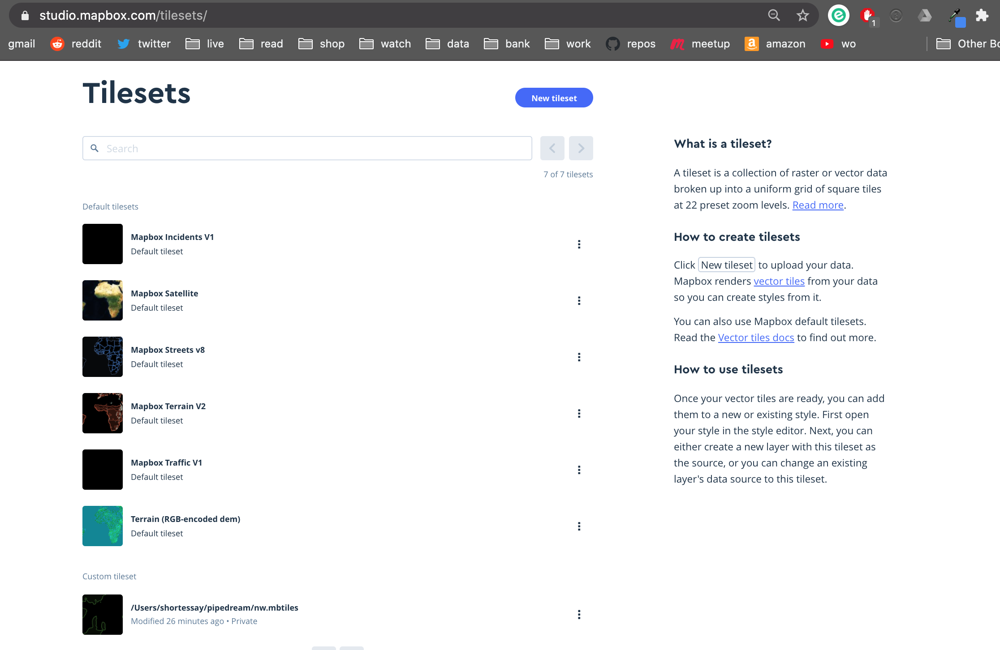
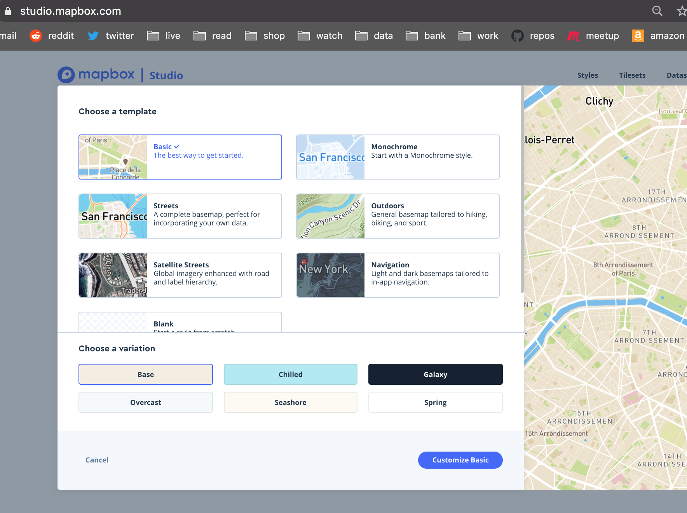
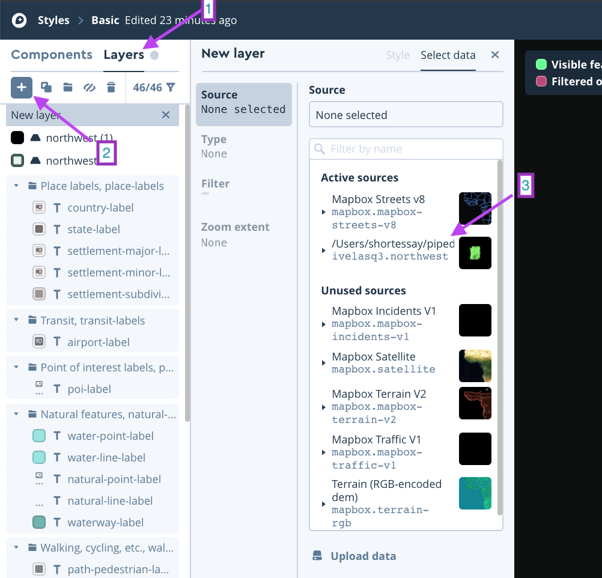
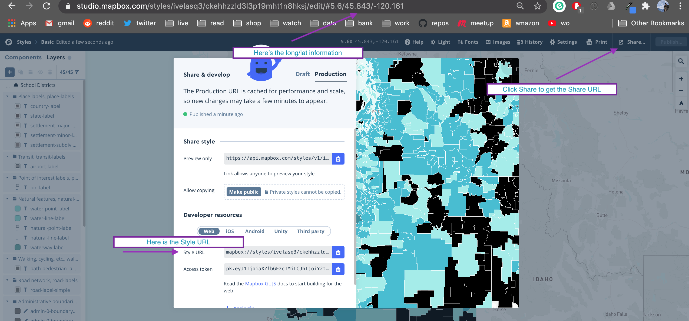

{fig-alt="Abstract painting of black rectangles on a yellow background"}

## An update to leaidr

A few months ago, I created [{leaidr}](https://github.com/ivelasq/leaidr) for easier download of U.S. school district shapefiles. [Daniel Anderson](https://github.com/datalorax) went through and greatly improved the package,  making it even easier to download and use the shapefiles (thanks Dan!).

Now, instead of having to run `lea_prep()`, you can download the shapefiles from Dan's Github repository like so:

```{r, message = FALSE, warning = FALSE, fig.align='center', fig.alt="Blank map of Tennessee school districts.", cache=TRUE}
library(leaidr)

tn <- lea_get("tn")

tn %>% 
  sf::st_as_sf() %>% 
  ggplot2::ggplot() +
  ggplot2::geom_sf()
```

And, if you use `lea_get()` (i.e., with `state = NULL`), you'll get the shapefiles for the whole U.S. back via ROpenSci’s {piggyback}.

So much easier and better!

Because Dan helped make the package so great, I wanted to add on and showcase what can be done with it! So, today's post is jam-packed with choices...

* [Create a beautiful map in Mapbox](#create-a-beautiful-map-in-mapbox)
* [Create a Shiny app with your beautiful  map](#create-a-shiny-app-with-your-beautiful-map)
* [Add a Shiny app to a package](#add-a-shiny-app-to-a-package)

## Create a beautiful map in Mapbox

Asmae Toumi wrote a [blog post](https://asmae-toumi.netlify.app/posts/2020-08-10-how-to-make-web-ready-us-county-level-maps/) on how to make maps using R and Mapbox. So, I figured: why not announce the new and improved {leaidr} functions to create a beautiful Mapbox map??

This walkthrough will go a little deeper with Mapbox, as I am an extreme beginner and had to do a lot of investigating to figure out how to use it.

I suggest first reading through Asmae's tutorial as there are a few things you need to do before being able to run the below: download the {mapboxapi} package, create a Mapbox account, and install Tippecanoe.

### Load the packages

Here are the packages you will need:

```{r, message = FALSE, warning = FALSE}
library(tidyverse)

# remotes::install_github("walkerke/mapboxapi")
library(mapboxapi)

# if you haven't installed the package yet
# devtools::install_github("ivelasq/leaidr")
library(leaidr)

library(rmapshaper)
library(mapdeck)
```

### Download the data

Download your shapefiles. If you want to make a choropleth map, also read in the data that you will append to your shapefiles and merge them by a common ID. (Sorry for using a local file!)

```{r, eval = FALSE}
shp <- # leaidr shapefiles
  lea_get(c("or", "wa")) %>% 
  sf::st_as_sf()

dat <- # data to append 
  read_csv("/Users/shortessay/Downloads/ccd_lea_141_1819_l_1a_091019/ccd_lea_141_1819_l_1a_091019.csv") %>%
  filter(ST %in% c("OR", "WA"))

northwest <-
  shp %>%
  select(GEOID, geometry) %>%
  sp::merge(dat, by.x = "GEOID", by.y = "LEAID")
```

### Create the tileset

Now, following the original tutorial, we use Tippecanoe to optimize the shapefiles and data and then upload the "tiles" to Mapbox.

```{r, eval = FALSE}
tippecanoe(
  input = northwest,
  output = "nw.mbtiles",
  layer_name = "northwest")

upload_tiles(input = "nw.mbtiles",
             username = "ivelasq3", 
             tileset_id = "northwest",
             multipart = TRUE)
```

### Style the tiles

This is the part that I had to figure out on the Mapbox website. [This](https://docs.mapbox.com/help/tutorials/choropleth-studio-gl-pt-1/) walkthrough was helpful. Once you have uploaded the tiles using `upload_tiles()`, you should see them available under "Custom tileset" at the bottom of this webpage: https://studio.mapbox.com/tilesets/.

{fig-alt="Screenshot of Mapbox website with Tilesets"}

Then, go to Styles on this webpage: https://studio.mapbox.com/. Click "New Style" and choose the template you want, then Customize. 

{fig-alt="Screenshot of Mapbox choosing a template"}

To add your tileset, go to Layers, click the Plus sign, then under "Source", find your uploaded tileset, or add the tileset by the ID given by `upload_tiles()`.

{fig-alt="Screenshot of Mapbox layers and how to add them"}

I zoomed to where my tiles are located (Oregon and Washington) and started editing. [This section of the walkthrough](https://docs.mapbox.com/help/tutorials/choropleth-studio-gl-pt-1/#data-driven-styling) explains how to create a choropleth map, where each geography has a different color according to a value.

Once done styling, I clicked "Publish" on the top right of Mapbox Studio.

### Using the map in R

To get the information to bring it back into R and be able to use the map in a Shiny app, I clicked "Share" and scrolled to find the Style ID.

{fig-alt="Screenshot of Mapbox sharing a map"}

I copied the Share URL to include in the function below. For the location parameter, I used the latitude/longitude listed in the browser URL. I played around with the zoom level until I found one I liked.

```{r, eval=FALSE}
mapdeck(token = Sys.getenv("MAPBOX_PUBLIC_TOKEN"),
        style = "mapbox://styles/ivelasq3/ckehhzzld3l3p19mht1n8hksj",
        zoom = 4,
        location = c(-120.161, 45.843))
```

## Create a Shiny app with your beautiful map

Once you have the `mapdeck()` function all set up, you can use it in a Shiny app. [Here's](https://github.com/greghuang8/Geovis/blob/master/shinyApp.R) some reference code that I found useful for using `renderMapdeck()`. Thank you Greg Huang!

This is an example of a very bare-bones Shiny app. For the UI, use `mapdeckOutput()`:

```{r, eval = FALSE}
library(tidyverse)
library(shiny)
library(mapdeck)

ui <- fluidPage(
  mapdeckOutput(outputId = "createMap")
)
```

And for the server, paste the `mapdeck()` function in `renderMapdeck()`:

```{r, eval = FALSE}
server <- function(input, output) {

  output$createMap <- renderMapdeck({
    mapdeck(token = Sys.getenv("MAPBOX_PUBLIC_TOKEN"),
            style = "mapbox://styles/ivelasq3/ckehhzzld3l3p19mht1n8hksj",
            zoom = 4,
            location = c(-120.161, 45.843))
  })
}
```

I uploaded the app [here](https://ivelasq.shinyapps.io/leaidr/).

## Add a Shiny app to a package

Now, say you would like to add the Shiny app to your package as well as upload it to shinyapps.io / instead of uploading to shinyapps.io. Thankfully, Dean Attali has a [great walkthrough](https://deanattali.com/2015/04/21/r-package-shiny-app/) on how to do this! 

1. Add {shiny} to your dependencies in your `DESCRIPTION` file (I do this with `usethis::use_package("shiny")`).
2. Create a folder called `inst` in your package with another folder for the Shiny example, and your UI/server file(s) within.
3. Create an R file to run your example (I used `usethis::use_r("runExample.R")`) to create this file.
4. Don't forget to document! `devtools::document()`

So, if you were to install and load {leaidr}, you can run `leaidr::runExample()` to launch the Shiny app. To see what the files look like, check out the Github repo files [here](https://github.com/ivelasq/leaidr/tree/master/inst/shiny-examples/mapbox).

## Conclusion

In conclusion, {leaidr} can help you map your data as long as you have school district LEAID's or names in there somewhere. I hope that it helps you in your education data projects!

<center>
*Liked this article? I’d love for you to retweet!*

<blockquote class="twitter-tweet"><p lang="en" dir="ltr">New goodies for leaidr, an <a href="https://twitter.com/hashtag/rstats?src=hash&amp;ref_src=twsrc%5Etfw">#rstats</a> pkg for school district shapefiles!<br><br>🤩 Major upgrade thx to <a href="https://twitter.com/datalorax?ref_src=twsrc%5Etfw">@datalorax</a><br>📓 New docs: <a href="https://t.co/yOszd3SG7e">https://t.co/yOszd3SG7e</a><br>🗺️ Mapbox example thx to <a href="https://twitter.com/asmae_toumi?ref_src=twsrc%5Etfw">@asmae_toumi</a><br>🌐 Shiny app IN package thx to <a href="https://twitter.com/daattali?ref_src=twsrc%5Etfw">@daattali</a><br>ℹ️ Walkthrough: <a href="https://t.co/i2I121b6a3">https://t.co/i2I121b6a3</a><br><br>Happy mapping 🤓 <a href="https://t.co/4hIgJ9evoX">pic.twitter.com/4hIgJ9evoX</a></p>&mdash; Isabella Velásquez (@ivelasq3) <a href="https://twitter.com/ivelasq3/status/1300446746955452416?ref_src=twsrc%5Etfw">August 31, 2020</a></blockquote> <script async src="https://platform.twitter.com/widgets.js" charset="utf-8"></script> 
</center>

