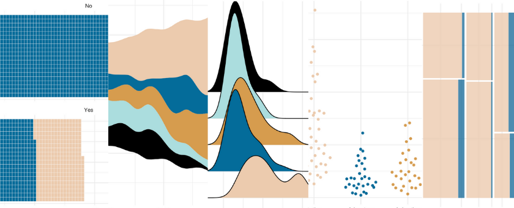

{fig-alt="A person working in fields of colorful tulips with houses in the background"}

R users are incredibly fortunate to work in an open-source community that creates and shares resources that make our work even better. The {ggplot2} package comes with incredibly useful geoms (geometric objects) to create visualizations. A full list of these can be found in the [reference documents](https://ggplot2.tidyverse.org/reference/) for {ggplot2}. These include:

* `geom_bar` and `geom_col` for barcharts
* `geom_histogram` for histograms
* `geom_point` for scatterplots

In addition, other amazing folks in the R Community have created geoms that can be used with {ggplot2} and similarly use the tidyverse framework. This is fantastic for many reasons, but some include being able to add themes, facets, titles, and other components just like with any `ggplot`. Here are a few geoms that I've tried out with examples!

* [Streamgraphs using ggstream::geom_stream](#streamgraphs)
* [Ridgeline plots using ggridges::geom_density_ridges](#ridgeline-plots)
* [Sankey diagrams using ggsankey::geom_sankey & ggalluvial::geom_alluvial](#sankey-diagrams)
* [Bump charts using ggbump::geom_bump](#bump-charts)
* [Waffle charts using waffle::geom_waffle](#waffle-charts)
* [Beeswarm charts using ggbeeswarm::geom_beeswarm](#beeswarm-charts)
* [Mosaic charts using ggmosaic::geom_mosaic](#mosaic-charts)

<center>
{fig-alt="Waffle plot, steamgraph, density graph, beeswarm, and mosaic plot"}
</center>

## Setup

To be able to run this code, be sure to have the tidyverse installed. The {wesanderson} package contains beautiful palettes for visualizations.

```{r, message = F}
# Load required packages

library(tidyverse)
library(wesanderson)
```

## Streamgraphs

This post includes three of David Sjöberg's amazing geoms; he created {ggsankey}, {ggstream}, AND {ggbump}. If you haven't seen his GitHub, please [check it out now](https://github.com/davidsjoberg).

This first geom, `geom_stream()`, creates a streamplot (which I've also seen called stream graphs). The streamplot is an area graph that usually centers around a central axis and allows us to see large fluctuations over time. More information on streamplot can be found [here](https://en.wikipedia.org/wiki/Streamgraph).

{ggstream} also has other options available to customize the streamgraphs, such as creating an area chart. Check out the repo [here](https://github.com/davidsjoberg/ggstream).

```{r, fig.align='center'}
# remotes::install_github("davidsjoberg/ggstream")
library(ggstream)

ggplot(blockbusters, aes(year, box_office, fill = genre)) +
  geom_stream() +
  scale_fill_manual(values = wes_palette("Darjeeling2")) +
  theme_minimal()
```


## Ridgeline plots

The {ggridges} package by Claus O. Wilke package also has a variety of geoms; check out the repo [here](https://github.com/wilkelab/ggridges). Ridgeline plots show the distribution of a numeric value for different groups and can look like mountain ranges. The [R-Ladies Seattle](https://www.meetup.com/rladies-seattle/) hex sticker was created using ridgelines (very appropriate for the mountainous Washington!).

```{r, message = F, fig.align='center'}
# install.packages("ggridges")
library(ggridges)
 
ggplot(blockbusters, aes(x = box_office, y = genre, fill = genre)) +
  geom_density_ridges(scale = 4) +
  scale_fill_manual(values = wes_palette("Darjeeling2")) +
  theme_minimal()
```

## Sankey diagrams

Another geom by David Sjöberg is `geom_sankey()`, repo [here](https://github.com/davidsjoberg/ggsankey). This geom creates [Sankey diagrams](https://en.wikipedia.org/wiki/Sankey_diagram) and [alluvial plots](https://en.wikipedia.org/wiki/Alluvial_diagram), which show flow and transfers in a system or throughout time. These plots are VERY popular on the subreddit [dataisbeautiful](https://www.reddit.com/r/dataisbeautiful/) (check it out on Mondays to see some examples).

```{r,  fig.align='center'}
# devtools::install_github("davidsjoberg/ggsankey")
library(ggsankey)

example_dat <-
  mtcars %>%
  make_long(cyl, vs, am, gear, carb) # function in ggsankey to format data correctly

ggplot(example_dat,
       aes(x = x, 
               next_x = next_x, 
               node = node, 
               next_node = next_node,
               fill = factor(node))) +
   geom_sankey(flow.alpha = .6) +
  theme_minimal()
```

Another package for alluvial charts is {ggalluvial} by Jason Cory Brunson, with its repo [here](https://corybrunson.github.io/ggalluvial/). The data can be in more familiar formats than what is required for {ggsankey}.

```{r,  fig.align='center'}
# install.packages("ggalluvial")
library(ggalluvial)

ggplot(as.data.frame(UCBAdmissions),
       aes(y = Freq, axis1 = Gender, axis2 = Dept)) +
  geom_alluvium(aes(fill = Admit), width = 1/12) +
  scale_fill_manual(values = wes_palette("Darjeeling2")) +
  theme_minimal()
```

## Bump charts

One last one by David Sjöberg is the amazing {ggbump}, repo [here](https://github.com/davidsjoberg/ggbump). Bump plots help show change in rank over time.

```{r,  fig.align='center'}
# devtools::install_github("davidsjoberg/ggbump")
library(ggbump)

blockbusters2 <-
  blockbusters %>% 
  filter(genre %in% c("Action", "Comedy", "Drama")) %>% 
  group_by(year) %>% 
  mutate(rank = rank(box_office))

ggplot(blockbusters2, aes(year, rank, color = genre)) +
  geom_point(size = 7) +
  geom_bump() +
  scale_color_manual(values = wes_palette("Darjeeling2")) +
  theme_minimal()
```


## Waffle charts

For waffle charts, which are handy visualizations that show completion or parts of a whole, there is hrbrmstr's {waffle}. The repo is [here](https://github.com/hrbrmstr/waffle). Check out the ability to bring in other {ggplot2} functions, like `facet_wrap`. {waffle} also allows you to create pictograms using `geom_pictogram`, which replaces the squares in the 'waffle' with pictures.

```{r,  fig.align='center'}
# install.packages("waffle", repos = "https://cinc.rud.is")
library(waffle)

ggplot(as_tibble(Titanic), aes(fill = Sex, values = n)) +
  geom_waffle(n_rows = 20, color = "white") +
  facet_wrap(~ Survived, ncol = 1)  +
  scale_fill_manual(values = wes_palette("Darjeeling2")) +
  theme_minimal()
```

## Beeswarm charts

Beeswarm charts, similar to jitter plots in {ggplot2}, plot individual points showing distributions without allowing the points to overlap too much. Erik Clarke's repo for {ggbeeswarm} is [here](https://github.com/eclarke/ggbeeswarm).

```{r,  fig.align='center'}
# install.packages("ggbeeswarm")
library(ggbeeswarm)

ggplot(blockbusters, aes(x = genre, y = box_office, color = genre)) + 
  geom_quasirandom() +
  theme_minimal() +
  scale_color_manual(values = wes_palette("Darjeeling2")) +
  theme_minimal()
```

## Mosaic charts

Mosaic charts are incredibly helpful when displaying proportions of (multiple) categories. The {ggmosaic} package by Haley Jeppson (repo [here](https://github.com/haleyjeppson/ggmosaic)) uses `geom_mosaic` to create these visualizations.

```{r,  fig.align='center', warning=FALSE}
# devtools::install_github("haleyjeppson/ggmosaic")
library(ggmosaic)

ggplot(as.data.frame(UCBAdmissions)) +
  geom_mosaic(aes(x = product(Admit, Dept), fill = Gender, weight = Freq)) +
  scale_fill_manual(values = wes_palette("Darjeeling2")) +
  theme_minimal()
```

## Other geoms

I know there exist a ton of other geoms that work with {ggplot2} out there. Just as I was writing this blogpost, I discovered {gghilbertstrings}! What other gg packages or geoms do you know of? Let me know on [Twitter](https://twitter.com/ivelasq3) and I'll list them here!

<center>
*Liked this post? I'd love for you to retweet!*

<blockquote class="twitter-tweet"><p lang="en" dir="ltr">New post 🚀 Into the ggplot2niverse! 🚀 We love geom_point, geom_bar, and the built-in geoms in <a href="https://twitter.com/hashtag/ggplot2?src=hash&amp;ref_src=twsrc%5Etfw">#ggplot2</a> but have you used <a href="https://twitter.com/hashtag/rstats?src=hash&amp;ref_src=twsrc%5Etfw">#rstats</a> pkgs with other geoms that use the <a href="https://twitter.com/hashtag/tidyverse?src=hash&amp;ref_src=twsrc%5Etfw">#tidyverse</a> like geom_sankey and geom_waffle? 🐝🧇 See them here &amp; let me know others <br>👉 <a href="https://t.co/orHyDMeVdd">https://t.co/orHyDMeVdd</a> <a href="https://t.co/DxKUxIJI08">pic.twitter.com/DxKUxIJI08</a></p>&mdash; Isabella Velásquez (@ivelasq3) <a href="https://twitter.com/ivelasq3/status/1376681492030558211?ref_src=twsrc%5Etfw">March 29, 2021</a></blockquote> <script async src="https://platform.twitter.com/widgets.js" charset="utf-8"></script> 
</center>
