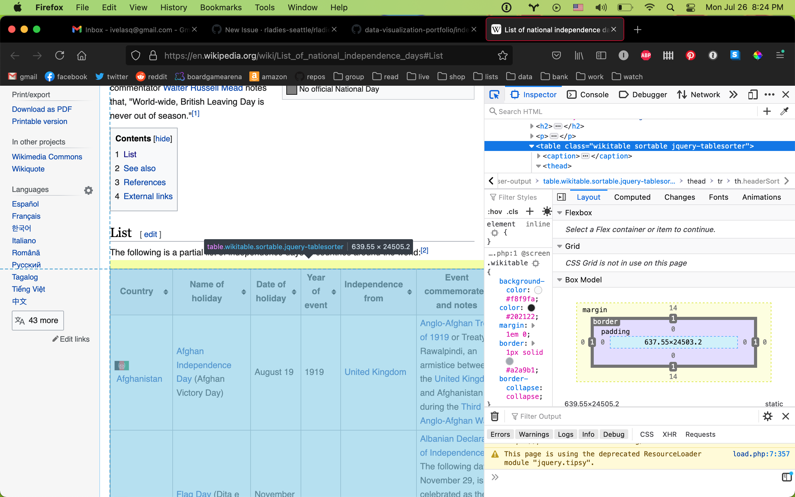

{fig-alt="Bunches of purple violets with a white background"}

[Wikipedia](https://en.wikipedia.org/wiki/Main_Page) is such an amazing website, and also a fantastic source of data for analysis projects. I often find myself [scraping](https://en.wikipedia.org/wiki/Web_scraping) Wikipedia's tables for information and then cleaning and using the data for whatever I am working on.

However, scraping a website can create issues if not done properly. Though not required, I like to use the [{polite} package](https://github.com/dmi3kno/polite) to introduce myself to the website and ask for permission to scrape.

Recently, I submitted the [Wikipedia table on independence days around the world](https://en.wikipedia.org/wiki/List_of_national_independence_days#List) to [TidyTuesday](https://github.com/rfordatascience/tidytuesday) - resulting in many beautiful and creative visualizations from the R Community! This post walks through how to "politely" scrape the table and pull it into a flat data frame so that it's ready for use.

## Load packages

There are several packages needed for this walkthrough:

```{.r}
# To clean data
library(tidyverse)
library(lubridate)
library(janitor)

# To scrape data
library(rvest)
library(httr)
library(polite)
```

## Scrape table

First, we save the web page with the table that we would like as `url`:

```{.r}
url <- "https://en.wikipedia.org/wiki/List_of_national_independence_days"
```

Next, we use `polite::bow()` to introduce ourselves to the host, Wikipedia. This reads the rules from `robots.txt` and makes sure we follow them. The object (`url_bow` in this case) is saved as an object of class `polite`.

```{.r}
url_bow <- polite::bow(url)
url_bow
```

Next, we actually 'scrape' (pull the content of) the web page using `polite::scrape()`. This needs an object of class `polite` (created with `bow()` from before).

Since we politely scraped the entire web page, we want to use {rvest} to specify what exact content we'd like to pull out. We can do this using `html_nodes()`.

How do we know which node we want? There are probably other ways of doing this. As a Firefox and Mac user, I click Cmd + Shift + C which opens up the Developer Tools so that I can select a specific element from the web page. I hover over the table to determine what the HTML is called, in this case, `table.wikitable`.

<center>
{fig-alt="Screenshot of Google's Inspector tool on Wikipedia"}
</center>

This object is saved as an HTML table which is great, but a data frame would be preferable for analysis. So the final step is to use `rvest::html_table()` to read this table as something with which we can use tidyverse tools. The parameter `fill = TRUE` allows you to fill empty rows with `NA`.

```{.r}
ind_html <-
  polite::scrape(url_bow) %>%  # scrape web page
  rvest::html_nodes("table.wikitable") %>% # pull out specific table
  rvest::html_table(fill = TRUE) 
```

## Flatten table

You will notice that `ind_html` is saved as a single object (a list) in which each element is a data frame. If we want to convert it to a flat data frame, we can specify that we want the content from only the first element `[[1]]`. We can then use `janitor::clean_names()` for nice, standardized column names.

```{.r}
ind_tab <- 
  ind_html[[1]] %>% 
  clean_names()
```

That's it! Now we've "politely" scraped the Wikipedia table into an analysis-ready data frame.

## Conclusion

Additional steps to clean the file can be found in my [GitHub repo](https://github.com/ivelasq/data-visualization-portfolio/blob/main/independence-days/independence_days.R). After doing so, I submitted to #TidyTuesday by submitting an [issue](https://github.com/rfordatascience/tidytuesday/issues) on their page. Then they approved and shared the dataset!

This was a very quick walkthrough. I recommend Ryo Nakagawara's [blog post on politely scraping websites](https://ryo-n7.github.io/2020-05-14-webscrape-soccer-data-with-R/), especially if you would like (1) more in-depth explanations of what {polite} does and (2) more complex scraping examples.

Which Wikipedia table will you analyze next?

<center>
*Liked this post? I'd love for you to retweet!*
<blockquote class="twitter-tweet"><p lang="en" dir="ltr">📢 A short blog post on how to &quot;politely&quot; scrape a Wikipedia table using <a href="https://twitter.com/hashtag/rstats?src=hash&amp;ref_src=twsrc%5Etfw">#rstats</a>. Which page will you scrape next?!<a href="https://t.co/cTIy8UIFKm">https://t.co/cTIy8UIFKm</a></p>&mdash; Isabella Velásquez (@ivelasq3) <a href="https://twitter.com/ivelasq3/status/1420022159947096065?ref_src=twsrc%5Etfw">July 27, 2021</a></blockquote> <script async src="https://platform.twitter.com/widgets.js" charset="utf-8"></script> 
</center>