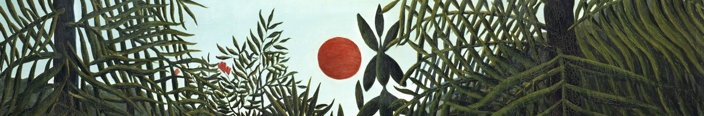
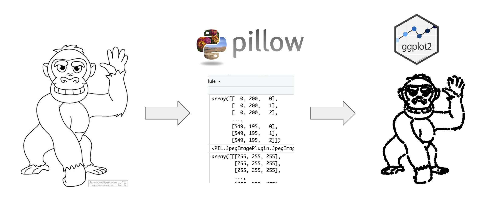
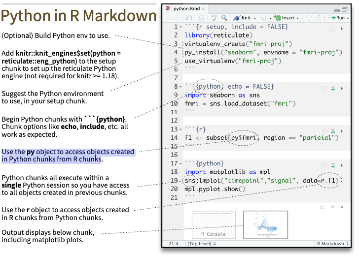
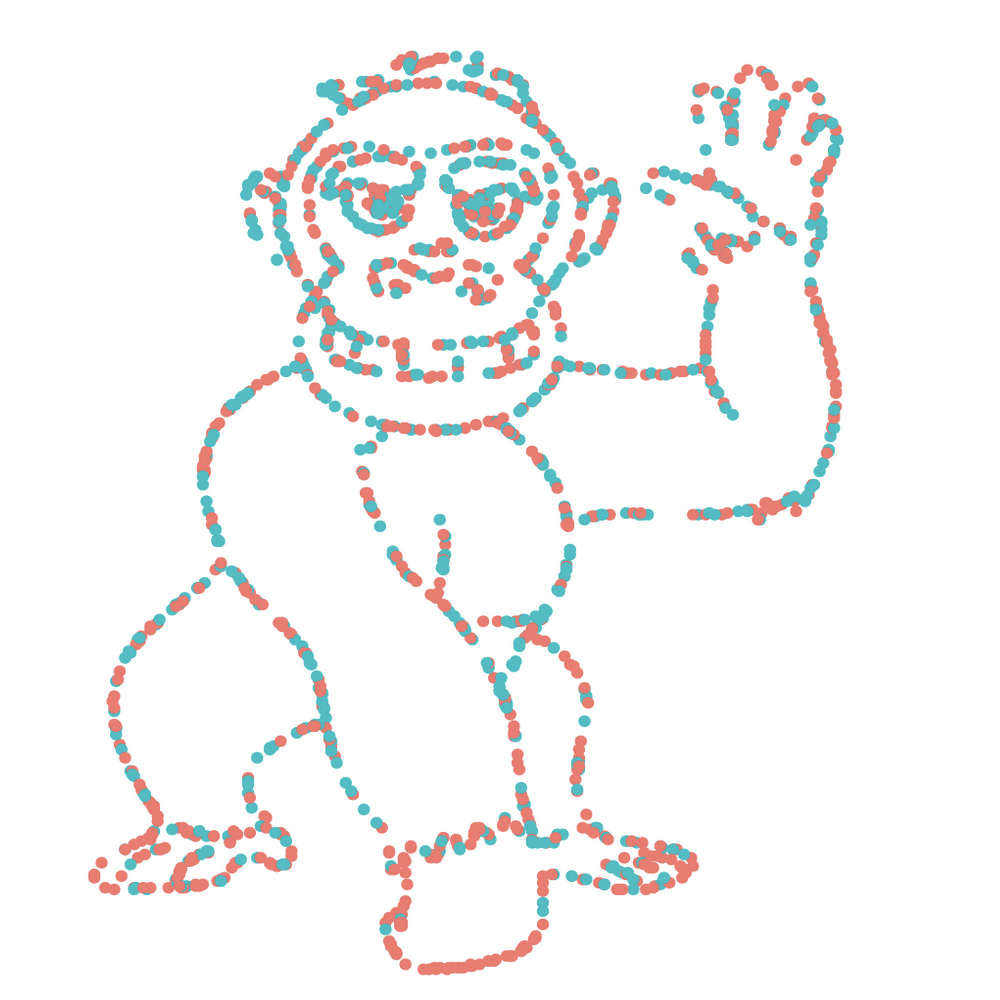

{fig-alt="Jungle with trees with a red sun"}

Last week, a paper started making the Twitter rounds. [Selective attention in hypothesis-driven data analysis](https://www.biorxiv.org/content/10.1101/2020.07.30.228916v1.full.pdf) by Professors Itai Yanai and Martin Lerche looked into whether providing specific hypotheses prevented students from fully exploring a dataset. The authors artificially created a dataset that, when plotted, clearly showed the outline of a cartoon gorilla.

<center>
{fig-alt="Cartoon gorilla and its recreation in ggplot2"}
</center>

I will leave you to read the paper to find out the results but something that interested me was the dataset created from the image. The authors mentioned that they used a Python function called 'getpixel', manipulated the dataset into groups, and plotted it in {ggplot2}. I am learning the [{reticulate}](https://rstudio.github.io/reticulate/) package which allows R to interface with Python and thought this would be a fun exercise to try.

With that, let's recreate this dataset entirely within R Markdown! In addition to being able to copy/paste the code below, I have also provided it as a project on [RStudio Cloud](https://rstudio.cloud/project/2949291) if you'd like to run the whole thing at once.

## Install packages

First up is installing the R packages:

````
```{r}`r ''`
# Install packages if not already installed
# install.packages(c("tidyverse", "reticulate"))
library(tidyverse)
library(reticulate)
```
````

In your project, create a folder called "image". Save the image you would like to convert to a dataset in that folder. To recreate this paper's dataset, go to [this](https://classroomclipart.com/clipart-view/Clipart/Black_and_White_Clipart/Animals/gorilla-waving-cartoon-black-white-outline-clipart-914_jpg.htm) page and download the cartoon gorilla.

The paper mentions the 'getpixel' function. With a bit of digging, we find that is from the package `pillow` (a fork from a package called `PIL`). Like in R, we need to install the package. In an R Markdown document, I run the functions from {reticulate} below.

````
```{r}`r ''`
use_python("/usr/local/bin/python")
# If you haven't installed Python, the line below will prompt you!
py_install("pillow")
```
````

Since {reticulate} is the package that allows you to call Python, if you do not have Python installed, then you will get a message (which you would reply Y to):

```
No non-system installation of Python could be found.
Would you like to download and install Miniconda?
Miniconda is an open source environment management system for Python.
See https://docs.conda.io/en/latest/miniconda.html for more details.
```

## Create coordinates

[This](https://stackoverflow.com/questions/58398300/find-all-coordinates-of-black-grey-pixels-in-image-using-python) Stack Overflow thread was very helpful to determine what we need to do with the 'getpixel' function in `pillow`. Again, like in R, we need to call the functions we need but this time, we are doing it in a `python` chunk.

````
```{python}`r ''`
import numpy as np
from PIL import Image
```
````

Then, we point to the image and create coordinates pixels for the outline of the cartoon. We can set a threshold level for which pixels to keep/discard.

````
```{python}`r ''`
# Thanks to Bart Huntley for pointing out a typo previously in this chunk!
im = Image.open("/cloud/project/image/gorilla.jpg")
pixels = np.asarray(im)

# Set threshold level
threshold_level = 50

# Find coordinates of all pixels below threshold
coords = np.column_stack(np.where(pixels < threshold_level))
```
````

## Bring back into R

This results in a NumPy ndarray called `coords` that contains the coordinates of the pixels of the outline. That's great but... it's in Python! How do we bring it back into R?

The [{reticulate} Cheat Sheet](https://ugoproto.github.io/ugo_r_doc/pdf/reticulate.pdf) was very helpful in figuring this out. The section "Python in R Markdown" shows that you can use the `py` object to access objects created in Python chunks from R chunks.

<center>
{fig-alt="Python in R Markdown cheat sheet"}
</center>
</center>

Knowing that, we can create an R object from coords using `py`. Next, we follow the steps outlined in the paper for the data preparation.

````
```{r}`r ''`
coords <-
  as.data.frame(py$coords) %>%
  sample_n(1768) %>%
  mutate(bmi = V2 * 17 + 15,
         steps = 15000 - V1 * 15000/max(V1)) %>%
  mutate(randvar = rnorm(n(), mean = 0, sd = 10),
         randi = steps * (1 + randvar),
         gender = case_when(randi < median(steps) ~ "Female",
                            TRUE ~ "Male"))
```
````

If we'd like to see the distribution of data by male/female, we can use `count()`.

````
```{r}`r ''`
coords %>%
  count(gender)
```
````

## Create plots
  
Now for the fun part - visualizing the plots (spoiler: one should always do this before starting an analysis)!

````
```{r}`r ''`
coords %>%
  ggplot(aes(x = bmi,
              y = steps)) +
  geom_point() +
  theme_void() +
  xlim(0, 15000)
```
````

<center>
{fig-alt="ggplot2 image of pixel cartoon gorilla"}
</center>

````
```{r}`r ''`
coords %>%
  ggplot(aes(x = bmi,
             y = steps,
             color = gender)) +
  geom_point() +
  theme_void() +
  xlim(0, 15000)
```
````

With that, we've seamlessly gone from Python to R and created a dataset leveraging the power of both languages. Thanks to Professors Yanai and Lerche for their publication!

<center>
{fig-alt="ggplot2 image of pixel cartoon gorilla with random dots colored by gender"}
</center>

<center>
*Liked this post? I'd love for you to retweet!*
<blockquote class="twitter-tweet"><p lang="en" dir="ltr">Did you see the paper where a dataset was created from a cartoon and thought, how do I create that using <a href="https://twitter.com/hashtag/rstats?src=hash&amp;ref_src=twsrc%5Etfw">#rstats</a>? This blog post walks through using reticulate to use <a href="https://twitter.com/hashtag/Python?src=hash&amp;ref_src=twsrc%5Etfw">#Python</a> and ggplot2 in the same R markdown notebook 😎🐍 <a href="https://t.co/4CbXzRd3PN">https://t.co/4CbXzRd3PN</a> <a href="https://t.co/Kq4WsaKHMk">pic.twitter.com/Kq4WsaKHMk</a></p>&mdash; Isabella Velásquez (@ivelasq3) <a href="https://twitter.com/ivelasq3/status/1443216191858769922?ref_src=twsrc%5Etfw">September 29, 2021</a></blockquote> <script async src="https://platform.twitter.com/widgets.js" charset="utf-8"></script> 
</center>