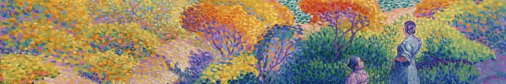

{fig-alt="Colorful dots making up a painting of a garden with two women"}

```{r, include = FALSE}
library(showtext)
font_add_google("Inter", "inter")
showtext_auto()
knitr::opts_chunk$set(message = FALSE,
                      warning = FALSE)

iv_palette <- c(
  `blue`   = "#0081e8",
  `purple1`  = "#9597f0",
  `purple2`      = "#d4b4f6",
  `purple3` = "#ffd6ff",
  `pink1`     = "#ffa1d4",
  `pink2` = "#ff688c",
  `red` = "#fb372d"
)

iv_colors <- function(...) {
  cols <- c(...)
  
  if (is.null(cols)) {
    return(iv_palette)
  }
  
  iv_palette[cols]
}

iv_colors()

iv_palettes <- list(
  `short` = iv_colors("blue", "purple2", "red"),
  `main` = iv_colors("blue", "purple1", "purple2", "purple3", "pink1", "pink2", "red")
)

iv_pal <- function(palette = "main", reverse = FALSE, ...) {
  pal <- iv_palettes[[palette]]
  
  if (reverse) pal <- rev(pal)
  
  grDevices::colorRampPalette(pal, ...)
}

scale_color_iv <- function(palette = "main", discrete = TRUE, reverse = FALSE, ...) {
  pal <- iv_pal(palette = palette, reverse = reverse)
  
  if (discrete) {
    ggplot2::discrete_scale("colour", paste0("iv_", palette), palette = pal, ...)
  } else {
    ggplot2::scale_color_gradientn(colours = pal(256), ...)
  }
}

scale_fill_iv <- function(palette = "main", discrete = TRUE, reverse = FALSE, ...) {
  pal <- iv_pal(palette = palette, reverse = reverse)
  
  if (discrete) {
    ggplot2::discrete_scale("fill", paste0("iv_", palette), palette = pal, ...)
  } else {
    ggplot2::scale_fill_gradientn(colours = pal(256), ...)
  }
}

theme_iv <- function() {
  ggplot2::theme_minimal(base_size = 11,
                         base_family = "Inter")
}

library(tidyverse)
library(tabulizer)
library(janitor)

knitr::opts_chunk$set(out.width = '100%')
```

I often use {ggplot2} to create graphs but there are certain things I *always* have to Google. I figured I'd create a post for quick reference for myself but I'd love to hear what you always have to look up!

* [Remove the Legend](#remove-the-legend)
* [Change Legend Title and Labels](#change-legend-title-and-labels)
* [Manually Change Colors](#manually-change-colors)
* [Remove X Axis Labels](#remove-x-axis-labels)
* [Start the Y Axis at a Specific Number](#start-the-y-axis-at-a-specific-number)
* [Use Scales on the Y Axis](#use-scales-on-the-y-axis)

To showcase what's happening, I am going to use a [TidyTuesday](https://github.com/rfordatascience/tidytuesday) dataset: Spotify songs! Let's start by creating a simple graph.

```{r, message = F, warning = F}
library(tidyverse)

# Load Data
spotify_songs <- 
  readr::read_csv('https://raw.githubusercontent.com/rfordatascience/tidytuesday/master/data/2020/2020-01-21/spotify_songs.csv')

spotify_songs %>% 
  ggplot(aes(x = playlist_genre)) +
  geom_histogram(stat = "count")
```

## Remove the legend

`theme(legend.position = "none")`

Ahh... this one always gets me. Sometimes when your color is mostly just for aesthetics,  it doesn't make sense to also have a color legend. This removes the legend and makes the graph look cleaner.

```{r, warning = F, message = F}
spotify_songs %>% 
  ggplot(aes(x = playlist_genre, fill = playlist_genre)) +
  geom_histogram(stat = "count") +
  theme(legend.position = "none")
```

## Change legend title and labels

`scale_fill_discrete(name = "New Legend Title", labels = c("lab1" = "Label 1", "lab2" = "Label 2"))`

Alright, say I do want the legend. How do I make it something readable?

```{r, warning = F, message = F}
spotify_songs %>% 
  ggplot(aes(x = playlist_genre, fill = playlist_genre)) +
  geom_histogram(stat = "count") +
  scale_fill_discrete(name = "Playlist Genre", 
                      labels = c("edm" = "EDM", 
                                 "latin" = "Latin", 
                                 "pop" = "Pop", 
                                 "r&b" = "R&B", 
                                 "rap" = "Rap", 
                                 "rock" = "Rock"))
```

## Manually change colors

`scale_fill_manual("New Legend Title", values = c("lab1" = "#000000", "lab2" = "#FFFFFF"))`

This is a bit trickier, in that you cannot use `scale_fill_manual` and `scale_fill_discrete` separately on the same plot as they override each other. However, if you want to change the labels *and* the colors together, you can use `scale_fill_manual` like below.

```{r, warning = F, message = F}
spotify_songs %>% 
  ggplot(aes(x = playlist_genre, fill = playlist_genre)) +
  geom_histogram(stat = "count") +
  scale_fill_manual(name = "Playlist Genre", 
                    labels = c("edm" = "EDM", 
                               "latin" = "Latin", 
                               "pop" = "Pop", 
                               "r&b" = "R&B", 
                               "rap" = "Rap", 
                               "rock" = "Rock"),
                    values = c("edm" = "#0081e8", 
                               "latin" = "#9597f0", 
                               "pop" = "#d4b4f6", 
                               "r&b" = "#ffd6ff", 
                               "rap" = "#ffa1d4", 
                               "rock" = "#ff688c"))
```

## Remove x-axis labels

`theme(axis.title.x = element_blank(), axis.text.x = element_blank(), axis.ticks.x = element_blank())`
        
In this case, since we have a legend, we don't need any x axis labels. Sometimes I use this if there's redundant information or if it otherwise makes the graph look cleaner.

```{r, warning = F, message = F}
spotify_songs %>% 
  ggplot(aes(x = playlist_genre, fill = playlist_genre)) +
  geom_histogram(stat = "count") +
  scale_fill_manual(name = "Playlist Genre", 
                    labels = c("edm" = "EDM", 
                               "latin" = "Latin", 
                               "pop" = "Pop", 
                               "r&b" = "R&B", 
                               "rap" = "Rap", 
                               "rock" = "Rock"),
                    values = c("edm" = "#0081e8", 
                               "latin" = "#9597f0", 
                               "pop" = "#d4b4f6", 
                               "r&b" = "#ffd6ff", 
                               "rap" = "#ffa1d4", 
                               "rock" = "#ff688c")) +
  theme(axis.title.x = element_blank(),
         axis.text.x = element_blank(),
         axis.ticks.x = element_blank())
```

## Start the y-axis at a specific number

`scale_y_continuous(name = "New Y Axis Title", limits = c(0, 1000000))`

Often times, we want our graph's y axis to start at 0. In this example it already does, but this handy parameter allows us to set exactly what we want our y axis to be.

```{r, warning = F, message = F}
spotify_songs %>% 
  ggplot(aes(x = playlist_genre, fill = playlist_genre)) +
  geom_histogram(stat = "count") +
  scale_fill_manual(name = "Playlist Genre", 
                    labels = c("edm" = "EDM", 
                               "latin" = "Latin", 
                               "pop" = "Pop", 
                               "r&b" = "R&B", 
                               "rap" = "Rap", 
                               "rock" = "Rock"),
                    values = c("edm" = "#0081e8", 
                               "latin" = "#9597f0", 
                               "pop" = "#d4b4f6", 
                               "r&b" = "#ffd6ff", 
                               "rap" = "#ffa1d4", 
                               "rock" = "#ff688c")) +
  theme(axis.title.x = element_blank(),
         axis.text.x = element_blank(),
         axis.ticks.x = element_blank()) +
  scale_y_continuous(name = "Count", limits = c(0, 10000))
```

## Use scales on the y-axis

`scale_y_continuous(label = scales::format)`

Depending on our data, we may want the y axis to be formatted a certain way (using dollar signs, commas, percentage signs, etc.). The handy {scales} package allows us to do that easily. 

```{r, warning = F, message = F}
spotify_songs %>% 
  ggplot(aes(x = playlist_genre, fill = playlist_genre)) +
  geom_histogram(stat = "count") +
  scale_fill_manual(name = "Playlist Genre", 
                    labels = c("edm" = "EDM", 
                               "latin" = "Latin", 
                               "pop" = "Pop", 
                               "r&b" = "R&B", 
                               "rap" = "Rap", 
                               "rock" = "Rock"),
                    values = c("edm" = "#0081e8", 
                               "latin" = "#9597f0", 
                               "pop" = "#d4b4f6", 
                               "r&b" = "#ffd6ff", 
                               "rap" = "#ffa1d4", 
                               "rock" = "#ff688c")) +
  theme(axis.title.x = element_blank(),
         axis.text.x = element_blank(),
         axis.ticks.x = element_blank()) +
  scale_y_continuous(name = "Count", limits = c(0, 10000),
                     labels = scales::comma)
```

There we have it! Six things I always eventually end up Googling when I am making plots using {ggplot2}. Hopefully now I can just look at this page instead of searching each and every time!

<center>
*Liked this post? I'd love for you to retweet!*
<blockquote class="twitter-tweet"><p lang="en" dir="ltr">I wrote a quick <a href="https://twitter.com/hashtag/rstats?src=hash&amp;ref_src=twsrc%5Etfw">#rstats</a> blogpost: &quot;Six Things I Always Google When Using ggplot2&quot; 🔎 📊 What do you always have to look up when creating your <a href="https://twitter.com/hashtag/ggplot2?src=hash&amp;ref_src=twsrc%5Etfw">#ggplot2</a> graphs? 🤔🤔 <a href="https://t.co/jEOR3RDDIh">https://t.co/jEOR3RDDIh</a></p>&mdash; Isabella Velásquez (@ivelasq3) <a href="https://twitter.com/ivelasq3/status/1222169501464133633?ref_src=twsrc%5Etfw">January 28, 2020</a></blockquote> <script async src="https://platform.twitter.com/widgets.js" charset="utf-8"></script> 
</center>