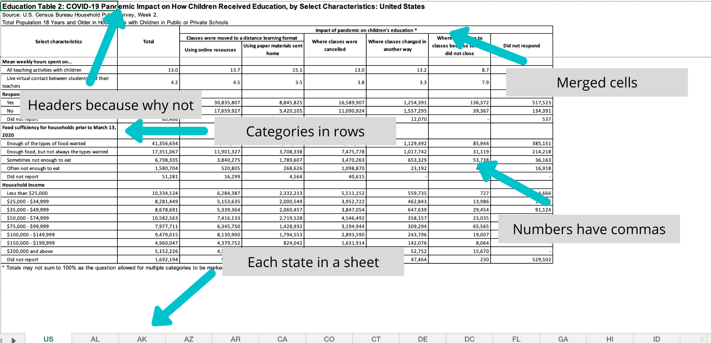
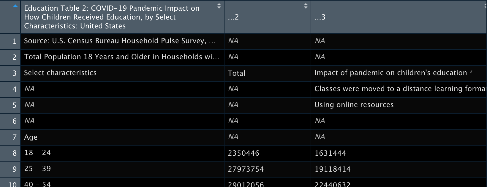
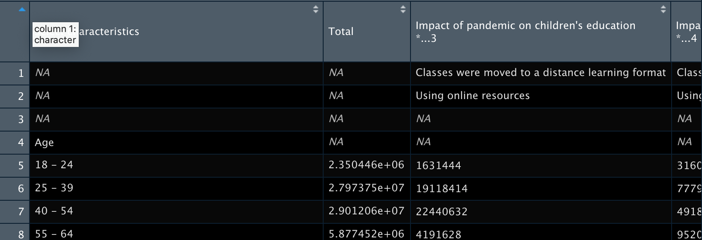
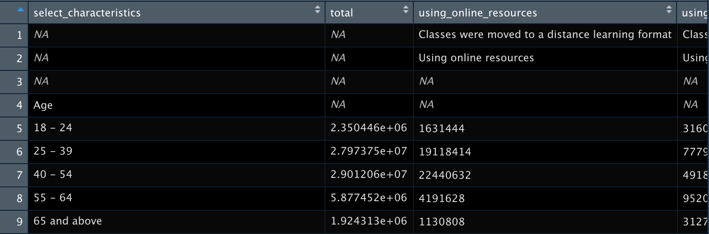
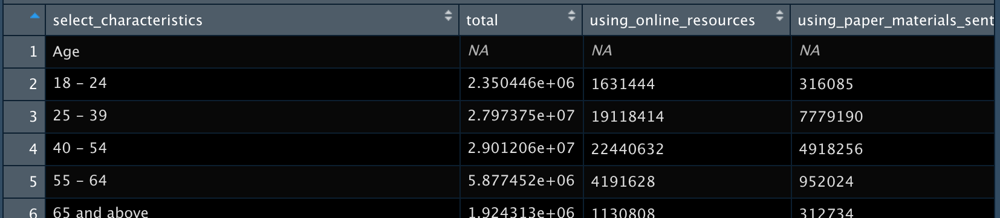
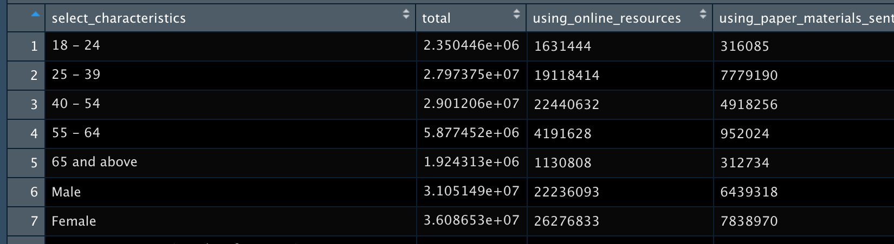
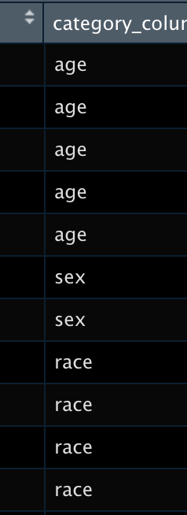
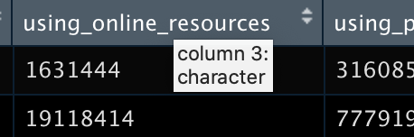
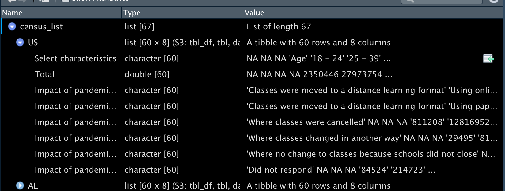

{fig-alt="A town of people skating on a frozen lake"}

The U.S. Census releases aggregate data on their [Household Pulse Survey](https://www.census.gov/data/tables/2020/demo/hhp2.html). These data are valuable and cover a range of important topics, particularly those related to the COVID-19 pandemic.

First of all, let me clarify that I think that the work that the Census does is amazing and I am so glad that these data are available. But, when you download the data, you will see that it is a highly stylized Excel spreadsheet. There may be upsides for those who want to see the data quickly and easily. As an R user though, seeing all those merged cells, non-numeric numerics, and category names in rows makes me feel `emo::ji('unamused')`.

{fig-alt="One of the Census Excel spreadsheets pointing out egregious formatting, like headers, merged cells, and categories in rows."}

However, this is not terribly surprising (and with public data, somewhat expected). As stated in the [tidy data](https://cran.r-project.org/web/packages/tidyr/vignettes/tidy-data.html) paper:

> It is often said that 80% of data analysis is spent on cleaning and preparing data.

Thankfully, we have the very powerful R and tidyverse available to address our data woes. Let's go through the process of tidying these data with tidyverse packages to show how easily they can become ready for analysis!

## Loading the data

As usual, we begin by loading our packages.

```{r, message = F, warning = F}
library(tidyverse)
library(readxl)
library(httr)
```

We have the option to download the Excel file and load it in R. But what if we want to load the data directly from the website? We can use {httr}! The following code 'gets' the file from the internet, writes it in a temporary file path, and loads it in an object called `path`.

> Many thanks to Liz Potamites for pointing out: if the below doesn't work, it may be that the link is changed or broken. It should be Table 2 from the second week of the Household Pulse Survey, which as of July 21, 2020, is located [here](https://www.census.gov/data/tables/2020/demo/hhp/hhp2.html).

```{r}
GET("https://www2.census.gov/programs-surveys/demo/tables/hhp/2020/wk2/educ2_week2.xlsx", write_disk(path <- tempfile(fileext = ".xlsx")))
```

## Cleaning the data

As mentioned in the figure above, each sheet comprises a state's data. It'd be good to have all of the data in one single data structure. One option is to try to force all of the sheets together at once in a data frame (which is a 2D structure). But we also saw that each sheet requires a lot of cleaning before it can be useful, and it may be difficult to clean if they're all merged in one data frame. Therefore, let's instead first read in all the data as a **list** (which is a higher dimension structure), clean it up, and *then* put it together in a data frame.

However, I am not very good at thinking about things in a list format and it's a little harder to see what's going on compared to looking at a data frame using `View()`. Before I clean up a list, I usually work on a single cut of the list as a data frame to know what exactly I am going to do. Thankfully, all the sheets in this Excel sheet are formatted the same across states. This isn't always the case! Because they are identically formatted, we know if our processing works on one sheet, it will work across all of them.

Let's look at a single sheet!

### Single sheet cleaning

```{r, message = F, eval = F}
census_sheet1 <-
  read_excel(path, sheet = 1)

View(census_sheet1)
```

{fig-alt="First three columns of the imported dataset, first column is the table title and the other two don't have names and are listed as dot dot dot 2 and dot dot dot 3."}

Immediately, we see that the top lines are superfluous rows (the headers from the original dataset). We can use `skip` in `read_excel()` to not have them read in.

```{r, message = F}
census_sheet1 <-
  read_excel(path, sheet = 1, skip = 3)

# View(census_sheet1)
```

{fig-alt="Dataset with skipped lines so that the column names are now characteristics, Total, and impact of the pandemic on children's education."}

Now that the unnecessary rows are gone, we see that the column names aren't reading in super well because of the merged cells in the original sheet. In this case, we manually create a vector of the column names and replace the old ones with `set_names()`.

```{r}
new_names <-
  c("select_characteristics", "total", "using_online_resources", "using_paper_materials_sent_home", "where_classes_were_cancelled", "where_classes_changed_in_another_way", "where_no_change_to_classes", "did_not_respond")

census_example <-
  census_sheet1 %>% 
  set_names(new_names)
```

{fig-alt="Dataset with cleaned names so that they are select underscore characteristics, total, and using online resources."}

We still have some empty rows (and also a row at the very bottom which is a note in the original dataset). We can eliminate these rows using `slice()`. Here, we're saying to 'slice' rows 1 through 3 and 60.

```{r}
census_example <-
  census_example %>% 
  slice(-1:-3, -60:-61)
```

{fig-alt="Dataset with removed rows so that the first rows start to line up with the columns."}

Now to deal with the fact that the category names are embedded within the first column `select_characteristics`. There may be other ways to do this, but again I manually create a vector with all the values that I want to get rid of and use `filter()` to keep only the rows that do **not** contain the items in the vector.

```{r}
filter_var <- 
  c("Age", "Sex", "Hispanic origin and Race", "Education", "Marital status", "Presence of children under 18 years old", "Respondent or household member experienced loss of employment income", "Mean weekly hours spent on…", "Respondent currently employed", "Food sufficiency for households prior to March 13, 2020", "Household income")

census_example <-
  census_example %>% 
  filter(!select_characteristics %in% filter_var) 
```

{fig-alt="Dataset with filtered rows so that the columns and rows match up."}

Even though we removed the characteristic names from the rows, they contain very useful information. Also, we run into an issue in which two of the characteristic categories had the same options ("yes" and "no"). If we don't address this, we'll forget which rows are for which characteristic. To fix this, we manually create a column with the characteristics for each of the response options and append it to the data.

```{r}
category_column <-
  c("age", "age", "age", "age", "age", "sex", "sex", "race", "race", "race", "race", "race", "education", "education", "education", "education", "marital_status", "marital_status", "marital_status", "marital_status", "marital_status", "children", "children", "loss_employment", "loss_employment", "loss_employment", "hours_spent", "hours_spent", "employed", "employed", "employed", "food_sufficiency", "food_sufficiency", "food_sufficiency", "food_sufficiency", "food_sufficiency", "income", "income", "income", "income", "income", "income", "income", "income", "income")

census_example <-
  census_example %>% 
  add_column(category_column)
```

<center>
{fig-alt="Column with variable names that repeat down the column."}
</center>

Finally, you may have noticed that some of the rows did not read in as numbers but as characters.

<center>
{fig-alt="Column with numbers but with character type."}
</center>

We can use `mutate_at()` and specify which variables we want to be numeric.

```{r, warning = F}
census_example <-
  census_example %>% 
  mutate_at(vars(total, using_online_resources:did_not_respond), list(~ as.numeric(.)))
```

Hooray - now we have a tidy dataset we could use for analysis! Which is great, but it's only one sheet. How do we do this for the additional 66?

### Multi-sheet cleaning

We will now download the data and store it in a list, where each sheet (which represents a state) is saved as a tibble within the list. To work across all the lists, we use the tidyverse package {purrr} and its handy functions.

You may notice that the multi-sheet cleaning looks a lot like the single sheet cleaning but everything is wrapped in the function `map()`. That's true! The wonderful thing about {purrr} being in the tidyverse is that it's really easy to integrate with all the tidyverse functions.

Reading the data into one list is slightly more complicated than reading in a single sheet. We begin with the file path from before and then use `excel_sheets()` to create a vector of the sheet names. `set_names()` ensures that we have a named list that contains the state names, which will be important later. If we don't use `set_names()`, then the tibbles have generic names instead of 'US', 'AL', etc. Then using `purrr::map()`, we ask R to download each of the sheets of the dataset and store it together in a list (`map()` always returns a list).

```{r, message = F}
census_list <-
  path %>% 
  excel_sheets() %>% 
  set_names() %>% 
  map(~ read_excel(path = path, sheet = .x, skip = 3), .id = "Sheet")
```

If you take a look at the list using `View(census_list)`, you can see the data is stored as tibbles within the list. If you expand `US`, you'll see the same data as when we did the single sheet example. You can also see the same data if you run `census_list[["US"]]`.

{fig-alt="Viewing the list of each state with the same data structure underneath"}

Using the same thinking as we did with the single sheet example, let's go through and clean up this list - without having to go into each tibble!

First, we set the names within each list using `set_names()`. We tell `map()` the names of the columns by defining `nm`.

```{r}
census_list <- 
  census_list %>% 
  map(., set_names, nm = new_names)
```

For each tibble in the list (`.x`), remove the rows 1 through 3 and 60.

```{r}
census_list <- 
  census_list %>% 
  map(~ slice(.x, -1:-3, -60:-61))
```

Now for each tibble, filter out the rows in `select_characteristics` that contain the items in `filter_var`.

```{r}
census_list <- 
  census_list %>% 
  map(~ filter(.x, !select_characteristics %in% filter_var))
```

Like before, we want a new column that lets us know the category for each of the characteristic options. 

```{r}
census_list <- 
  census_list %>% 
  map(~ add_column(.x, category_column))
```

And like before, we want to make sure our numeric columns are actually numeric.

```{r, warning = F, message = F}
census_list <- 
  census_list %>% 
  map(~ mutate_at(.x, vars(total, using_online_resources:did_not_respond), list(~ as.numeric(.))))
```

Now that our tibbles are all clean and uniform, let's make this a single, 2D data frame! As I mentioned before, our list should contain the state abbreviations. We can use `map_df()` to create a data frame with an ID column called `state` that stores each of the sheet names. With this column, we'll easily know which column is for which state/geography.

```{r}
census_df <- 
  census_list %>% 
  map_df(~ as.data.frame(.x), .id = "state")
```

Congrats! We have successfully tidied a Census dataset!

## Using the data

The purpose of all this work is to be able to use it easily in R and with the tidyverse specifically. Let's use the plotting package {ggplot2} to make something!

According to the Census website, we can calculate percentages by removing those that did not respond from the total for the denominator (let's presume that NA in the column means that everybody responded). Let's say we want to see the proportion of respondents in the U.S. who say their classes were canceled by income level.

```{r, fig.align = "center", fig.alt="Barplot showing percent of classes that were cancelled by income group, with lower income groups more likely to report cancelled classes"}
census_us_income <-
  census_df %>% 
  filter(state == "US", category_column == "income") %>% 
  mutate(responses = case_when(!is.na(did_not_respond) ~ total - did_not_respond, 
                               is.na(did_not_respond) ~ total),# calculate denominator
         pct_cancelled = where_classes_were_cancelled / responses) # calculate percentage

census_us_income <- # setting factor levels so graph shows correct order
  census_us_income %>% 
  mutate(select_characteristics = factor(select_characteristics,
                                         levels = c("Less than $25,000", 
                                                    "$25,000 - $34,999",
                                                    "$35,000 - $49,999",
                                                    "$50,000 - $74,999",
                                                    "$75,000 - $99,999",
                                                    "$100,000 - $149,999",
                                                    "$150,000 - $199,999",
                                                    "$200,000 and above")))

census_us_income %>% 
  filter(select_characteristics != "Did not report") %>% 
  ggplot(aes(x = select_characteristics, y = pct_cancelled)) +
  geom_bar(stat = "identity",
           fill = "#00C3DA") +
  theme_minimal() +
  theme(axis.text.x = element_text(angle = 45, hjust = 1)) +
  scale_y_continuous(labels = scales::percent) +
  labs(title = "Percent of Respondents Whose Children's Classes Were Cancelled",
       x = "Income",
       y = "Percent with Classes Cancelled",
       caption = "Source: U.S. Census")
```

From this graph, we can see that respondents from the lower-income bands were more likely to say that classes were canceled for their children due to COVID.

<center>
*Liked this article? I’d love for you to retweet!*

<blockquote class="twitter-tweet"><p lang="en" dir="ltr">New blogpost 📣: What It Takes to Tidy Census Aggregate Data! ⭐ Let&#39;s take all those heavily formatted Excel sheets and make them a plain and simple data frame together! <a href="https://t.co/IsPb8BJ0ZT">https://t.co/IsPb8BJ0ZT</a> <a href="https://twitter.com/hashtag/rstats?src=hash&amp;ref_src=twsrc%5Etfw">#rstats</a> <a href="https://t.co/XABr07wYfP">pic.twitter.com/XABr07wYfP</a></p>&mdash; Isabella Velásquez (@ivelasq3) <a href="https://twitter.com/ivelasq3/status/1266372221179588609?ref_src=twsrc%5Etfw">May 29, 2020</a></blockquote> <script async src="https://platform.twitter.com/widgets.js" charset="utf-8"></script> 
</center>