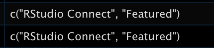

I am excited to announce that I've joined the RStudio Marketing team! I will be creating content on the [RStudio Blog](https://blog.rstudio.com/) that will announce news and share stories from the company, users, and partners. I just started this week and, ready to jump in, I decided that I’d like to deep dive into previous blog posts.

The RStudio blog is written using [blogdown](https://bookdown.org/yihui/blogdown/) and each blog entry contains metadata in the YAML header. Since there are hundreds of blog entries, I decided to use R to quickly pull all this information into an analyzable data frame. While figuring out how to do this, I was reminded of why I am so excited to join RStudio in the first place (and if you want to jump straight into the code, click [here](#the-code)!)

## The awesomeness that is the R community

As I started the task of pulling the YAML information, I remembered a blogpost from [Garrick Aden-Buie](https://twitter.com/grrrck) called [Find, count and list tags in all blogdown posts](https://www.garrickadenbuie.com/blog/find-blogdown-tags/) (thanks, Garrick!). The post taught me about `blogdown:::scan_yaml()` which was exactly what I needed to get the information from all the YAML headers in the files.

The members of the R Community, including others at RStudio, are incredibly collaborative and helpful, and I hope to be able to contribute to others’ learning as well.

## RStudio tools rock

I remember when my older brother introduced me to the tidyverse in graduate school after I had been struggling to understand how to program in R. I was amazed by its usability and functionality and it enabled me to learn more, learn quicker, and learn better. I've been fortunate enough to use RStudio tools for my work, like [Shiny](https://shiny.rstudio.com/) and [shinyapps.io](https://www.shinyapps.io/), and each time appreciated the thoughtful and deep work that RStudio does with its services and products. 

How great is it that the blogdown team anticipated the need to look at a blog’s metadata and already created a function that scans the YAML?! And that we can create a blog using R? And doing so is excellently [documented](https://bookdown.org/yihui/blogdown/)?

In addition, below you will see many different [tidyverse](https://www.tidyverse.org/) packages (dplyr, here, tibble, tidyr) being used as well. The seamless integration of R packages, tools, and services makes projects like this one possible and easy.

## So much to write about

If you check out the [tags](https://blog.rstudio.com/tags/) from the RStudio blog, you will see so many topics. APIs! BI tools! Package development! Interoperability! RStudio is working on so many things, open source and enterprise, and it is thrilling to be part of an organization that advocates for [code-first](https://blog.rstudio.com/2021/05/12/code-first-data-science-for-the-enterprise2/) development, thrives in a diverse and supportive community, and thinks creatively about what challenges to tackle next.

## A new chapter in my RStudio journey

I am proud to join an organization that I’ve long admired and hope that my contributions in this realm of RStudio's business will promote the uptake of amazing RStudio products, and the crucial work RStudio does in free open-source software, data science education, and other spaces as a Public Benefit Corporation. I look forward to working alongside my colleagues at RStudio to achieve the company's vision.

And with that… I give you, the code!

## The code

### Pulling YAML metadata for each blog post

I intended to create a data frame from a blogdown where every row represents a blog entry, and where we will have columns for (1) its title, (2), its author(s), (3) associated tags, and (4) associated categories. If you are using this code on your blogdown, you can change them to whichever YAML fields you would like.

```{r, eval=FALSE}
# Load libraries
library(tidyverse)

# Find the folder with the blog posts
blogdown_content_path <- here::here("content", "post")

# Scan yaml of all posts (make sure the blogdown project is open)
meta_list <-
  blogdown:::scan_yaml(blogdown_content_path)

# Create a data frame that pulls out the title, date, categories, and tags for each entry
meta_df <- tibble(
  title = map_chr(meta_list, "title"),
  date = map(meta_list, "date"),
  categories = map(meta_list, "categories"),
  tags = map(meta_list, "tags"))
```

In this case, there are entries where there is a vector within categories or tags - this is because a single blog post can have multiple categories or tags (see example [here](https://blog.rstudio.com/2021/08/30/rstudio-connect-2021-08-custom-branding/), which has “rstudio connect” and “featured” as categories).

<center>

</center>

The following code separates the tags or categories with multiple values so that each value has its own column using a `pivot_longer()` followed by `unnest()`, then re-pivots the table to wide format using `pivot_wider()`.

```{r, eval=FALSE}
meta_df_clean <-
  meta_df %>%
  # Put the fields with multiple options into one column called variable
  pivot_longer(cols = c("categories", "tags"),
               names_to = "variable",
               values_to = "value") %>%
  # Split out the fields with multiple options into individual rows
  unnest(cols = value) %>%
  # For each blog entry, give each category or tag a number
  group_by(title, variable) %>%
  mutate(id = row_number()) %>%
  # Pivot back to wide format
  pivot_wider(names_from = c("id", "variable"),
              names_glue = "{variable}_{id}",
              values_from = value)
```

And that’s it! Now we have a data frame with each row denoting a blog entry, with its associated metadata.

Thank you so much for reading this article and I look forward to seeing you on the [RStudio blog](https://blog.rstudio.com) or [Twitter](https://twitter.com/ivelasq3).

<center>
*Liked this post? I'd love for you to retweet!*
<blockquote class="twitter-tweet"><p lang="en" dir="ltr">Here&#39;s how to pull the YAML for your blogdown posts using <a href="https://twitter.com/hashtag/rstats?src=hash&amp;ref_src=twsrc%5Etfw">#rstats</a>; figuring out how to do this was a great example of why I am excited to join RStudio 🥳<br><br>blogpost with code: <a href="https://t.co/RdI4zEwfX8">https://t.co/RdI4zEwfX8</a><br>h/t to <a href="https://twitter.com/grrrck?ref_src=twsrc%5Etfw">@grrrck</a> &#39;s post on finding tags in blogdown: <a href="https://t.co/p85frQbAiG">https://t.co/p85frQbAiG</a> <a href="https://t.co/bWwH2rsIYf">pic.twitter.com/bWwH2rsIYf</a></p>&mdash; Isabella Velásquez (@ivelasq3) <a href="https://twitter.com/ivelasq3/status/1437402771947458565?ref_src=twsrc%5Etfw">September 13, 2021</a></blockquote> <script async src="https://platform.twitter.com/widgets.js" charset="utf-8"></script> 
</center>
