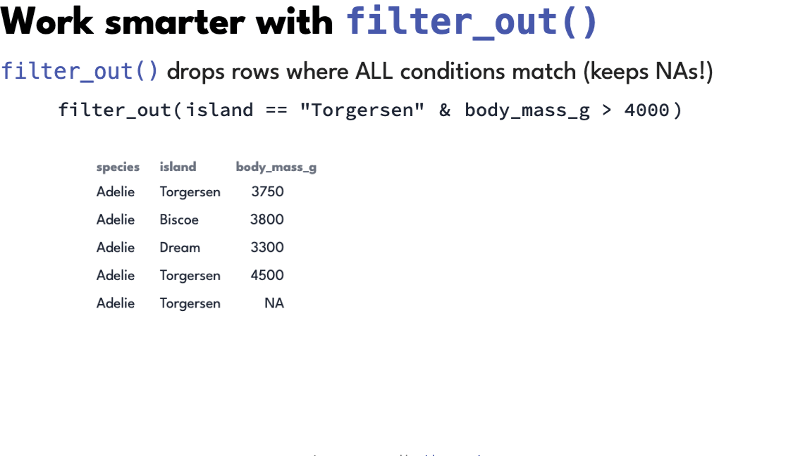
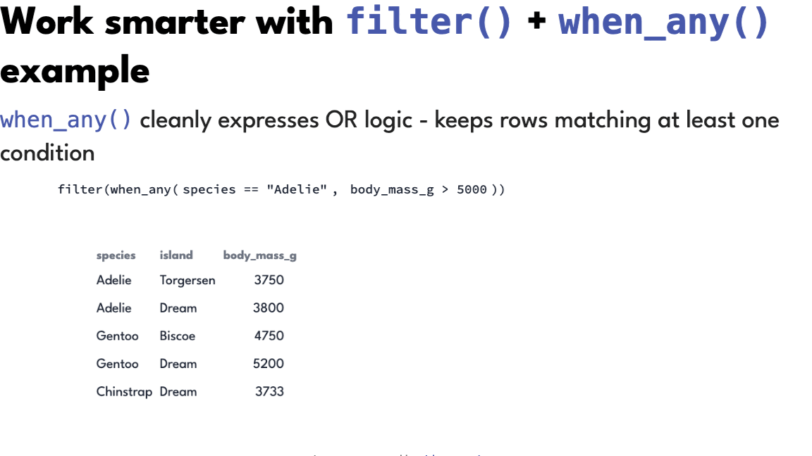
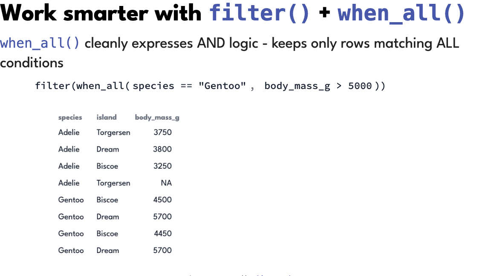
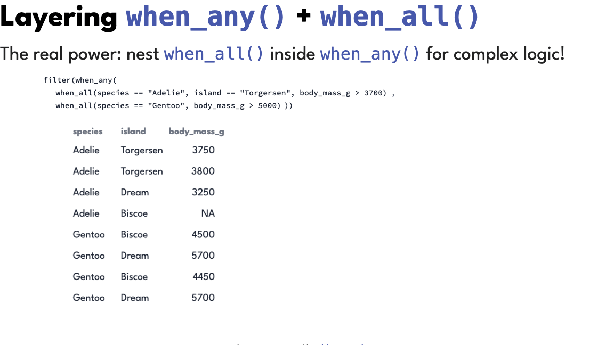
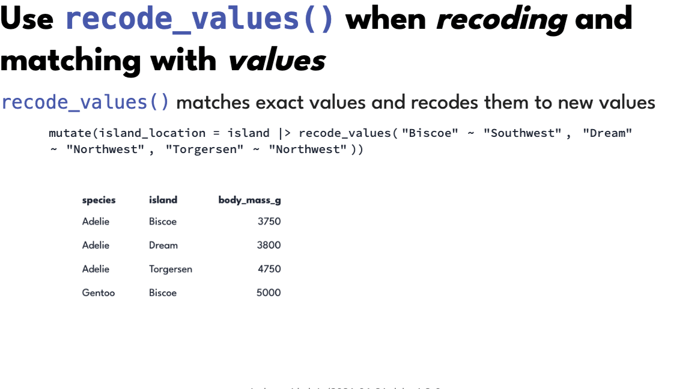
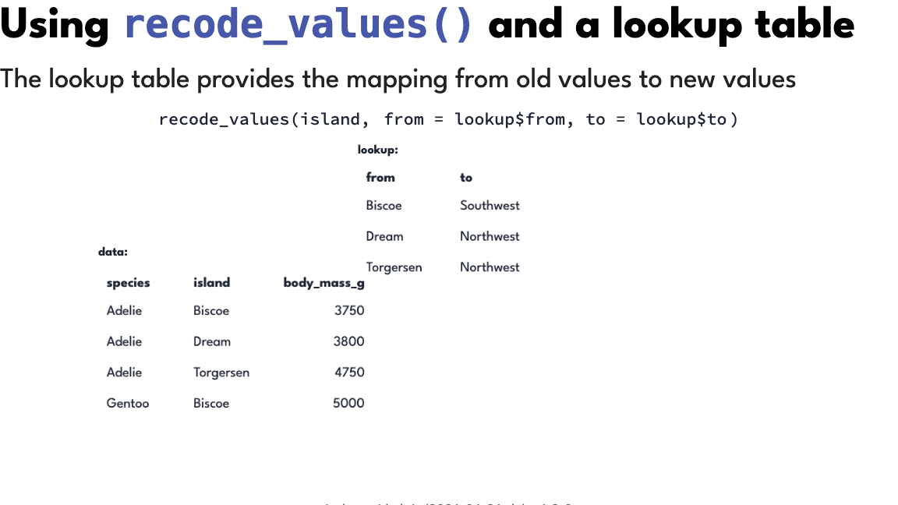

```{=html}
<a href="https://www.meetup.com/rladies-abuja/events/315092217/?eventOrigin=group_events_list" class="btn btn-secondary">
  <i class="bi bi-calendar-event"></i>&nbsp;&nbsp;Event
</a>

<a href="https://ivelasq.github.io/2026-06-24_dplyr-1-2-0/" class="btn btn-secondary" target="_blank" rel="noopener noreferrer">
  <i class="bi bi-tv"></i>&nbsp;&nbsp;Slides
</a>

<a href="https://github.com/ivelasq/2026-06-24_dplyr-1-2-0" class="btn btn-secondary" target="_blank" rel="noopener noreferrer">
  <i class="bi bi-github"></i>&nbsp;&nbsp;Repo
</a>

<a href="https://www.youtube.com/watch?v=Ka9wf3Z2IcY" class="btn btn-secondary" target="_blank" rel="noopener noreferrer">
  <i class="bi bi-youtube"></i>&nbsp;&nbsp;Recording
</a>  
```

<br>

## Details

<ul style="list-style-type: none; padding-left: 0;">
  <li>👥 <a href="https://www.meetup.com/rladies-abuja/events/315092217/?eventOrigin=group_events_list">R-Ladies Abuja</a></li>
  <li>📆 24 June 2026 // 06:00 PM WAT</li>
  <li>💻️ Virtual</li>
</ul>

## Description

Discover how the latest features in {dplyr} 1.2.0 can help you write cleaner, faster, and more maintainable data transformation workflows. This session explores practical techniques for filtering, joining, summarizing, and reshaping data more efficiently, with real-world examples that demonstrate how to streamline your R code and improve productivity.

## Slides

<iframe src="https://ivelasq.github.io/2026-06-24_dplyr-1-2-0/" height="415" width="800" ></iframe>

## Recording

<iframe width="800" height="415" src="https://www.youtube.com/embed/Ka9wf3Z2IcY?si=fULdAOyq46z5HhKH" title="YouTube video player" frameborder="0" allow="accelerometer; autoplay; clipboard-write; encrypted-media; gyroscope; picture-in-picture; web-share" referrerpolicy="strict-origin-when-cross-origin" allowfullscreen></iframe>

## Summary

_This summary was generated by Claude Sonnet 5 and reviewed by me._

[dplyr 1.2.0](https://tidyverse.org/blog/2026/02/dplyr-1-2-0/) shipped a set of
functions that make two very common jobs — **dropping rows** and **recoding
values** — say what they actually mean.

::: {.callout-tip}
## The short version

| Instead of… | Reach for… |
|---|---|
| `filter(!cond)` | `filter_out(cond)` |
| `filter()` with an OR operator | `filter(when_any(...))` |
| `&` groups nested inside an OR | `when_all()` inside `when_any()` |
| `case_when(x == "a" ~ ...)` | `recode_values(x, "a" ~ ...)` |
| `case_when(..., .default = x)` to tweak a few values | `replace_values()` / `replace_when()` |

:::

```{r}
#| label: setup
#| message: false
library(dplyr)
library(palmerpenguins)
```

### `filter_out()`

Drops rows where **all** conditions match — and keeps `NA` rows, because a row
with a missing value was never shown to match.

```{r}
#| label: filter-out
penguins |>
  filter_out(island == "Torgersen" & body_mass_g > 4000)
```

{fig-alt="Animation: filter_out(island == \"Torgersen\" & body_mass_g > 4000) highlights the rows matching each condition, then drops only the row matching both, leaving the NA row in place."}

**Rule of thumb:** if there's a `!` in your `filter()`, reach for `filter_out()`.

### `when_any()`

Expresses OR logic as a list of alternatives: keep the row if it matches
**at least one**.

```{r}
#| label: when-any
penguins |>
  filter(when_any(
    species == "Adelie",
    body_mass_g > 5000
  ))
```

{fig-alt="Animation: filter(when_any(species == \"Adelie\", body_mass_g > 5000)) highlights rows matching either condition and keeps their union."}

**Rule of thumb:** if your `filter()` has complex OR expressions, reach for
`when_any()`.

### `when_all()`

The AND counterpart: keep the row only if it matches **every** condition.

```{r}
#| label: when-all
penguins |>
  filter(when_all(
    species == "Gentoo",
    body_mass_g > 5000
  ))
```

{fig-alt="Animation: filter(when_all(species == \"Gentoo\", body_mass_g > 5000)) keeps only the rows matching both conditions."}

**Rule of thumb:** for a simple AND you don't need it — commas in `filter()`
already mean AND. Its real job is nesting.

### `when_all()` inside `when_any()`

Nest them and complex logic reads as an outline instead of an expression.

```{r}
#| label: when-nested
penguins |>
  filter(when_any(
    when_all(species == "Adelie", island == "Torgersen", body_mass_g > 3700),
    when_all(species == "Gentoo", body_mass_g > 5000)
  ))
```

{fig-alt="Animation: filter(when_any(when_all(...), when_all(...))) showing two nested condition groups and the rows each contributes to the result."}

**Rule of thumb:** reach for the nested form when each alternative needs more
than one condition.

### `recode_values()`

Matches values directly instead of writing `column ==` over and over. Name the
column once, then list the mappings.

```{r}
#| label: recode-values
penguins |>
  mutate(island_location = island |> recode_values(
    "Biscoe"    ~ "Southwest",
    "Dream"     ~ "Northwest",
    "Torgersen" ~ "Northwest"
  ))
```

{fig-alt="Animation: mutate(island_location = island |> recode_values(\"Biscoe\" ~ \"Southwest\", \"Dream\" ~ \"Northwest\", \"Torgersen\" ~ \"Northwest\")) filling the new column."}

Add `unmatched = "error"` and a stray category raises an error instead of
silently becoming `NA`.

**Rule of thumb:** if you're writing `==` inside `case_when()`, reach for
`recode_values()`.

### `recode_values()` with a lookup table

Because the mappings are values rather than code, they can live in a data frame —
which means they can live in a spreadsheet, a database, or someone else's repo.

```{r}
#| label: recode-values-lookup
lookup <- tibble(
  from = c("Biscoe", "Dream", "Torgersen"),
  to   = c("Southwest", "Northwest", "Northwest")
)

penguins |>
  mutate(
    island_location = recode_values(island, from = lookup$from, to = lookup$to)
  )
```

{fig-alt="Animation: recode_values(island, from = lookup$from, to = lookup$to) with a two-column lookup table mapping each island to a location."}

**Rule of thumb:** once you have more than a handful of mappings, put them in a
lookup table.

### `replace_values()` and `replace_when()`

`case_when()` and `recode_values()` *create* a column, so every row needs a
value and anything uncovered needs a `.default`. The `replace_*()` family
*modifies* a column instead — unmatched values simply stay as they are.

```{r}
#| label: replace-values
#| eval: false
# swap specific values
penguins_located |>
  mutate(
    island_location = island_location |>
      replace_values(
        "Northwest" ~ "Northern Palmer Archipelago"
      )
  )

# swap values matching a condition
penguins |>
  mutate(body_mass_g = replace_when(body_mass_g, body_mass_g > 5000 ~ 5000))
```

**Rule of thumb:** if you want to change some values and keep the rest, reach
for `replace_*()` rather than `case_when()` with a `.default`.

## Summary

⬢ Use `filter()` to **keep** rows

⬢ Use `filter_out()` to **drop** rows — especially if you're reaching for `!`

⬢ Use `when_any()` for **OR** logic, when the expressions get complex

⬢ Use `when_all()` for **AND** logic, especially nested inside `when_any()`

⬢ Use `recode_values()` for **exact matches**, instead of `==` in `case_when()`

⬢ Use `replace_values()` / `replace_when()` to **modify** an existing column

## Links

* [dplyr](https://dplyr.tidyverse.org)
* [dplyr 1.2.0 blog post](https://tidyverse.org/blog/2026/02/dplyr-1-2-0/)
* [dplyr performance blog post](https://tidyverse.org/blog/2026/02/dplyr-performance/)
* [Tidyups repo](https://github.com/tidyverse/tidyups)
* [tidy-animations by Emil Hvitfeldt](https://emilhvitfeldt.github.io/tidy-animations/)
