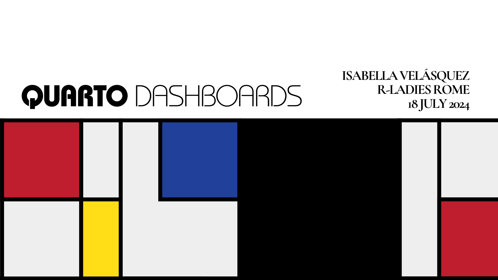

+---------------+---------------------------------------------+
| Abstract      | In this workshop, you’ll dive into          | 
|               | the world of Quarto, exploring how to       |
|               | create dynamic and interactive dashboard    |
|               | for data visualization. Whether you’re a    |
|               | beginner or seasoned developer, this session|
|               | session promises to enhance your skills and |
|               | empower you with practical knowledge.       |
+---------------+---------------------------------------------+
| Date          | 18 July 2024                                |
+---------------+---------------------------------------------+
| Time          | 11:00 AM CT                                 |
+---------------+---------------------------------------------+
| Location      | Remote                                      |
+---------------+---------------------------------------------+
| Event         | [**R-Ladies Rome**](https://www.meetup.com/rladies-rome/events/302078218/) |
+---------------+---------------------------------------------+
| Repository    | [**GitHub**](https://github.com/ivelasq/2024-07-18_quarto-dashboards)
+---------------+---------------------------------------------+
| Slides        | [**Posit Connect Cloud**](https://bit.ly/quarto-dashboards)
+---------------+---------------------------------------------+
| Recording     | [**YouTube**](https://www.youtube.com/watch?v=Kq1hgg2NtE4)
+---------------+---------------------------------------------+

