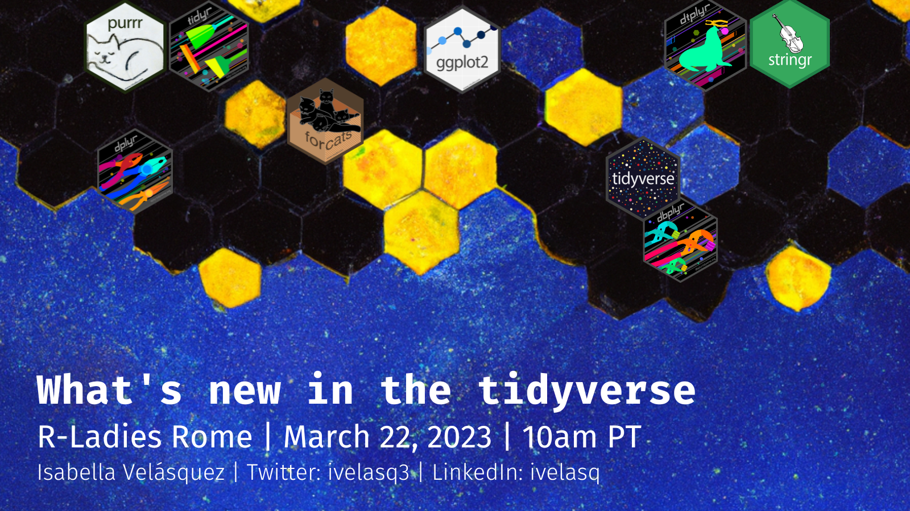

+---------------+---------------------------------------------+
| Abstract      | If you're an R user, chances are you've     |
|               | heard of the tidyverse - a suite of         |
|               | packages that's revolutionized data         |
|               | wrangling, visualization, and analysis. And |
|               | if you've been following the tidyverse      |
|               | blog, you'll know there's been a veritable  |
|               | flood of new functions and feature releases |
|               | lately.                                     |
|               |                                             |
|               | In this talk, we'll give you the inside     |
|               | scoop on all the latest and greatest        |
|               | updates to the tidyverse. From a new family |
|               | of string-separating functions to a bunch   |
|               | of new joins, we'll show you how this       |
|               | cutting-edge universe of packages can make  |
|               | your life as a data scientist easier, more  |
|               | efficient, and more intuitive. So buckle up |
|               | and get ready to explore what's new in the  |
|               | tidyverse!                                  |
+---------------+---------------------------------------------+
| Date          | 22 March 22 2023                            |
+---------------+---------------------------------------------+
| Time          | 10:00 AM PT                                 |
+---------------+---------------------------------------------+
| Location      | Remote                                      |
+---------------+---------------------------------------------+
| Event         | [**R-Ladies Rome**](https://www.meetup.com/rladies-rome/events/291643998/) 
+---------------+---------------------------------------------+
| Repository    | [**GitHub**](https://github.com/ivelasq/2023-03-22_whats-new-in-the-tidyverse) 
+---------------+---------------------------------------------+
| Website       | [**Site**](https://ivelasq.github.io/2023-03-22_whats-new-in-the-tidyverse/) 
+---------------+---------------------------------------------+
| Recording     | [**YouTube**](https://www.youtube.com/watch?v=qyaQXGzhhZg)                             |
+---------------+---------------------------------------------+

