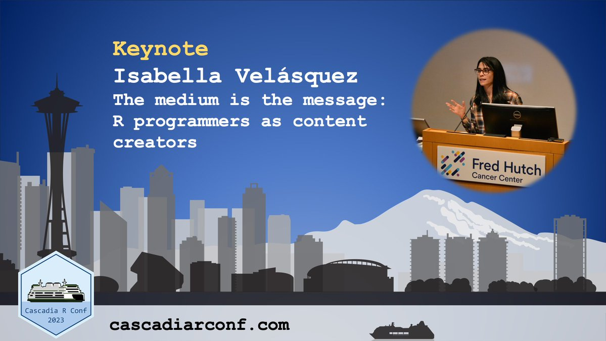

| **Detail**     | **Information**                                                                                      |
|----------------|------------------------------------------------------------------------------------------------------|
| **Date**       | 19 August 2023                                                                                     |
| **Time**       | 9:15 AM PT                                                                                         |
| **Location**   | Seattle, WA                                                                                        |
| **Event**      | [**Cascadia R Conference 2023**](https://cascadiarconf.com/)                                     |
| **Repository** | [**GitHub**](https://github.com/ivelasq/you-r-a-content-creator/)                                 |
| **Slides**     | [**Quarto Pub**](https://ivelasq.quarto.pub/you-r-a-content-creator/)                             |

Slide 1

How many of us have seen this diagram before? As R programmers, the topic of data wrangling is probably not new. We know that data can be inherently valuable, but can be complex and overwhelming in its raw form. We know our role is to take these data and transform them into something that others can consume. And our job doesn’t end there - we also need to actually communicate findings or model results or crosstabs or whatever we actually did with the data.

Slide 2

These were my primary responsibilities at my previous job as a data analyst. I worked with publicly available data such as government databases or online repositories, sometimes interacting with them through APIs. I had to download, organize, and maintain datasets from these multiple sources. Sometimes, I would run into issues like limitations with the data or unexpected formats. Once I had it processed and cleaned, then it was time to present my findings. Great.

Slide 3

When I first started, I would share my findings with my manager. She preferred using PowerPoint decks. These decks had headings summarizing the data's main points and a big visualization with annotations. She'd ask for these decks through email and then set up one-on-one discussions with me. During these meetings, we'd cover how I organized the data, any insights, the main takeaways, and any important details she needed to know when using the deck.

<table>
  <tr>
   <td>Audience
   </td>
   <td>Medium
   </td>
   <td>Channel
   </td>
  </tr>
  <tr>
   <td>Manager
   </td>
   <td>PowerPoint decks
   </td>
   <td>Email/one-on-one discussions
   </td>
  </tr>
</table>

Slide 4

But then, as we became more familiar, my manager asked me to email the directors and deputies directly. The directors and deputies were enthusiastic about exploring the data themselves. They wanted to make their own tables and summaries and derive their own insights. So, while they liked the PowerPoint slides, they often wanted the raw data in the form of Excel sheets. I began attaching these sheets to emails and arranging meetings to discuss what they were interested in so we could do the analysis together.

<table>
  <tr>
   <td>Audience
   </td>
   <td>Medium
   </td>
   <td>Channel
   </td>
  </tr>
  <tr>
   <td>Manager/Deputy/DDs
   </td>
   <td>PowerPoint decks
   </td>
   <td>Email/one-on-one discussions
   </td>
  </tr>
  <tr>
   <td>Deputy/DDs
   </td>
   <td>Excel spreadsheets
   </td>
   <td>Email/data workshops
   </td>
  </tr>
</table>

Slide 5

But I also had teammates who needed to access and edit my code. They preferred downloading everything at once. And then they would run their analysis, reproducing or expanding on what I had created. So, we used GitHub, a platform for sharing and collaborating with code. They could clone a project and get everything on their computer to work with. And in order for me to document what they needed to know, we started a Wiki with information on the data, the analysis, and reproducibility steps.

<table>
  <tr>
   <td>Audience
   </td>
   <td>Medium
   </td>
   <td>Channel
   </td>
  </tr>
  <tr>
   <td>Manager/Deputy/DDs
   </td>
   <td>PowerPoint decks
   </td>
   <td>Email/one-on-one discussions
   </td>
  </tr>
  <tr>
   <td>Deputy/DDs
   </td>
   <td>Excel spreadsheets
   </td>
   <td>Email/data workshops
   </td>
  </tr>
  <tr>
   <td>Analysts
   </td>
   <td>Code/data/output
   </td>
   <td>GitHub/Wiki
   </td>
  </tr>
</table>

Slide 6

But I also had colleagues curious about our analyses. We began sending email newsletters with links to the slide decks so they could also access and see what we were working on, and decide whether they were interested in perusing the deck.

<table>
  <tr>
   <td>Audience
   </td>
   <td>Medium
   </td>
   <td>Channel
   </td>
  </tr>
  <tr>
   <td>Manager/Deputy/DDs
   </td>
   <td>PowerPoint decks
   </td>
   <td>Email/one-on-one discussions
   </td>
  </tr>
  <tr>
   <td>Deputy/DDs
   </td>
   <td>Excel spreadsheets
   </td>
   <td>Email/data workshops
   </td>
  </tr>
  <tr>
   <td>Analysts
   </td>
   <td>Code/data/output
   </td>
   <td>GitHub
   </td>
  </tr>
  <tr>
   <td>Colleagues
   </td>
   <td>PowerPoint decks
   </td>
   <td>Email newsletters
   </td>
  </tr>
</table>

Slide 7

These colleagues liked the slide decks but wanted reports tailored to their needs. I used R Markdown to make parameterized reports for different regions or demographics they cared about. These reports would have a heading, bullet points with key takeaways, then some narrative around the data being shared, and then crosstabs or tables specific to each group. Then, I shared these reports through an internal website made with blogdown. I made sure the website was user-friendly, so my colleagues could easily find the reports they needed, along with extra information about the data.

<table>
  <tr>
   <td>Audience
   </td>
   <td>Medium
   </td>
   <td>Channel
   </td>
  </tr>
  <tr>
   <td>Manager/Deputy/DDs
   </td>
   <td>PowerPoint deck
   </td>
   <td>Email
   </td>
  </tr>
  <tr>
   <td>Deputy/DDs
   </td>
   <td>PowerPoint deck/CSVs
   </td>
   <td>Email
   </td>
  </tr>
  <tr>
   <td>Analysts
   </td>
   <td>Code/notebooks/CSVs/output
   </td>
   <td>GitHub
   </td>
  </tr>
  <tr>
   <td>Colleagues
   </td>
   <td>PowerPoint deck
   </td>
   <td>Email newsletters
   </td>
  </tr>
  <tr>
   <td>Colleagues
   </td>
   <td>Parameterized Word reports
   </td>
   <td>Internal website made with blogdown
   </td>
  </tr>
</table>

Slide 8

But some colleagues didn't want to click through many reports to compare different subgroups. They needed something quicker to switch between and regular reports didn't cut it. Instead, for them, I made Shiny apps and created short videos to help them use and understand the dashboards.

<table>
  <tr>
   <td>Audience
   </td>
   <td>Medium
   </td>
   <td>Channel
   </td>
  </tr>
  <tr>
   <td>Manager/Deputy/DDs
   </td>
   <td>PowerPoint deck
   </td>
   <td>Email
   </td>
  </tr>
  <tr>
   <td>Deputy/DDs
   </td>
   <td>PowerPoint deck/CSVs
   </td>
   <td>Email
   </td>
  </tr>
  <tr>
   <td>Analysts
   </td>
   <td>Code/notebooks/CSVs/output
   </td>
   <td>GitHub
   </td>
  </tr>
  <tr>
   <td>Colleagues
   </td>
   <td>PowerPoint deck
   </td>
   <td>Email newsletters
   </td>
  </tr>
  <tr>
   <td>Colleagues
   </td>
   <td>Parameterized Word reports
   </td>
   <td>Internal repository
   </td>
  </tr>
  <tr>
   <td>Other colleagues
   </td>
   <td>Shiny apps/video tutorials
   </td>
   <td>Internal repository
   </td>
  </tr>
</table>

Slide 9

Others from different teams joined the newsletter and used the internal repository. The communications team contacted me to write blog posts and create infographics to share externally. But they didn’t want to share the regular reports I had with colleagues. They asked for blog posts that told a story, with lots of pictures and visuals, to interest a bigger audience. These would go on the company blog and social media.

<table>
  <tr>
   <td>Audience
   </td>
   <td>Medium
   </td>
   <td>Channel
   </td>
  </tr>
  <tr>
   <td>Manager/Deputy/DDs
   </td>
   <td>PowerPoint deck
   </td>
   <td>Email
   </td>
  </tr>
  <tr>
   <td>Deputy/DDs
   </td>
   <td>PowerPoint deck/CSVs
   </td>
   <td>Email
   </td>
  </tr>
  <tr>
   <td>Analysts
   </td>
   <td>Code/notebooks/CSVs/output
   </td>
   <td>GitHub
   </td>
  </tr>
  <tr>
   <td>Colleagues
   </td>
   <td>PowerPoint deck
   </td>
   <td>Email newsletters
   </td>
  </tr>
  <tr>
   <td>Colleagues
   </td>
   <td>Parameterized Word reports
   </td>
   <td>Internal repository
   </td>
  </tr>
  <tr>
   <td>Other colleagues
   </td>
   <td>Shiny apps/video tutorials
   </td>
   <td>Internal repository
   </td>
  </tr>
  <tr>
   <td>External interested parties
   </td>
   <td>Blog posts and infographics
   </td>
   <td>Company blog/social media
   </td>
  </tr>
</table>

Slide 10

While my main focus was data analysis for internal use, I wanted to share what I was learning in R, like code snippets and workflow recommendations. Since this was more general, I was able to share it on my personal accounts. So, I began writing on my personal blog and sharing social media posts to share my insights.

<table>
  <tr>
   <td>Audience
   </td>
   <td>Medium
   </td>
   <td>Channel
   </td>
  </tr>
  <tr>
   <td>Manager/Deputy/DDs
   </td>
   <td>PowerPoint deck
   </td>
   <td>Email
   </td>
  </tr>
  <tr>
   <td>Deputy/DDs
   </td>
   <td>PowerPoint deck/CSVs
   </td>
   <td>Email
   </td>
  </tr>
  <tr>
   <td>Analysts
   </td>
   <td>Code/notebooks/CSVs/output
   </td>
   <td>GitHub
   </td>
  </tr>
  <tr>
   <td>Colleagues
   </td>
   <td>PowerPoint deck
   </td>
   <td>Email newsletters
   </td>
  </tr>
  <tr>
   <td>Colleagues
   </td>
   <td>Reports
   </td>
   <td>Internal website
   </td>
  </tr>
  <tr>
   <td>External interested parties
   </td>
   <td>Text and infographics
   </td>
   <td>Company blog/social media
   </td>
  </tr>
  <tr>
   <td>External R programmers
   </td>
   <td>Blog posts with narrative and code
   </td>
   <td> 
   </td>
  </tr>
</table>

And essentially, for each analysis I did, I considered all these audiences, activities, and channels and decided which ones I would take on and how. I was a data analyst for five years, and after a while, I reflected on my role and tasks, all the analyses I had done, along with everything I shared, and how all these activities were received, and the decisions that were made based on what I had created. And then I thought…

Slide 11

Am I an influencer?!

That is a bit of a joke, but really, it underlies what I wanted to talk about today. Sometimes we say we’re going to create a slide deck or dashboard as if those two things were interchangeable to the people receiving them. But one thing that I realized over time is that they are not.

Slide 12

1. Medium Matters: First, it really matters to the audience whether we are sending them a slide deck or a report or a dashboard or a spreadsheet. The medium we use influences how the message is perceived and understood.
2. Tailoring Communication: Different audiences have different preferences and needs. Adapting our communication style to suit the audience's preferences can enhance the impact of our insights and findings. And it wasn’t just their personal preference, but sometimes specific contexts required one format or another. 
3. Medium Shapes Visibility: The medium we choose has a direct impact on whether our work gets noticed at all.

Slide 13

Ever heard the phrase 'The Medium is the Message'? This concept, coined by Marshall McLuhan, suggests that the medium used to convey information is just as important as the information itself. In essence, how you communicate shapes how your message is perceived. Whether you are using a dashboard, or a report, or a CSV, each has its own unique characteristics with different effects on people. At first, this concept might seem vague. But I can honestly say that understanding the meaning behind these words changed the way I approach data analysis; not just from a technical or procedural standpoint, but from a mental perspective on how R programmers should approach and design for an audience.

Slide 14

So, today, I'm here to delve deeper into the 'communicate' phase of the data wrangling workflow. This encompasses understanding the audience, selecting the right medium, choosing appropriate channels, and incorporating special features for effective communication. Or, in other words, content creation.

Slide 15

To define content, at its most basic level, it includes:

* The information and/or experience
* The medium/channel in which the information is delivered
* Any beneficial features the medium adds to the information or experience

Slide 16

What exactly is a content creator? Through my extensive Google research, one definition is 'A content creator is someone who crafts informative or engaging material to be communicated through diverse mediums or channels.'  In other words, every one of us! For R programmers, content creation involves shaping data insights and findings into compelling formats. This can include creating newsletters, emails, wikis, articles, reports, and more, all with the goal of connecting and resonating with the intended audience. Content itself encompasses a range of experiences, including workshops and webinars, to deliver information to end users. In the context of business, content becomes vital as it's the substance from which users derive value.

Slide 17

One of my esteemed colleagues, Joseph Rickert, kindly pointed out that 'content' is a marketing term, and honestly, before my current role as a Sr. Product Marketing Manager, I never thought of my work as content creation. Traditionally, content creation is closely associated with marketing teams, strategically employed to boost sales and revenue by engaging external audiences to do things like visit your website, call your sales team, etc. 

However, the principles of content creation hold significant value even within internal contexts. For R programmers predominantly working within an organization, content creation becomes a powerful tool for collaboration, understanding, and decision-making. By tailoring content to different teams and departments, we can ensure that our analyses resonate effectively. The goal of a content creator is to attract, engage, and delight - add value at every stage and build trust, credibility, and momentum. As people working with data, these are our goals as well.

Slide 18

The content that you create is important, of course. But the way you deliver the content is part of the whole - you need to champion knowledge through your content. And the way you do this is by understanding your audience.

Slide 19

A few months ago, I gave a talk to R-Ladies St. Louis called Intro to Quarto. Quarto is an open-source tool for creating documents using literate programming, or a mix of code and narrative. You can use Quarto to output to Word, PDFs, HTML, etc. from one source.

Consider walking through how to create a Quarto document by talking through some slides. (here I’d walk through creating a Quarto document with some slides)

Or, consider what it would be like to watch a live demo of creating a Quarto document. (here I’d walk through creating a Quarto document with a live demo)

Or, consider what it would mean to be given a Posit Cloud project where you can create your first Quarto document. (here I point to a Posit Cloud project)

Each of these are viable and effective ways of introducing Quarto to an interested group. When I was coming up with the talk, I thought about:

* Level of Engagement: Tailor the level of engagement to match your audience's preferences. Are they looking for a high-level overview or a deep dive into technical details? This might inform whether you would just send them an email with top-level takeaways or schedule a time to wade in the data together. This would be an online webinar that ran an hour. Therefore, there would be enough time to go into the concepts of Quarto and specific details on how it works.
* Interactivity: Assess how interactive your content should be. Some audiences might prefer interactive tools like dashboards to explore data themselves, while others might prefer static visualizations that present the information clearly without requiring interaction. Since it was online, I wouldn’t be able to guide people individually and troubleshoot with them one-on-one. Therefore, I elected to instead give the deep dive and provide options for interactive use for after the webinar.
* Intended Depth of Understanding: Gauge how deep your audience wants to delve into the subject matter. Determine whether they're seeking a broad understanding of key insights or a detailed understanding of the methodology and data. This guides us in deciding whether to provide high-level summaries or comprehensive explanations. I wanted attendees to leave the webinar ready to create a Quarto document. Therefore, I needed to give them enough information such that they left confident in next steps to try without my help.

“The medium is the message” because it is the “medium that shapes and controls the scale and form of human association and action.” Because the media are inherently different, we experience the content in entirely different ways.

Slide 20

And as R users, we are better suited than most for content creation because of the tools we have.

Tools for creation

* R Markdown/Quarto documents that can be exported to Word, PDFs, HTML
* R Markdown/Quarto projects for websites, books, blogs, presentations
* The {officer} package lets R users manipulate Word and PowerPoint documents
* Shiny apps that make our R scripts into dashboards
* {ggplot2} for beautiful visualizations
* {writexl} for writing to Excel

Slide 12 

Hopefully, I have convinced you that yes, R programmers can be content creators. So, how can we be effective content creators?

* 1. Roadmap: Every piece of content you create should be viewed as a valuable addition to a growing library of insights. Imagine your team becoming the go-to source for data-driven information that supports multiple teams across the organization. By developing a content roadmap, you're not just creating standalone pieces; you're building a resource that contributes to the long-term knowledge base of your organization.
* 2. Before you start crafting new content, take a moment to assess what you already have. This not only saves you hours of needless work but also helps you identify gaps and opportunities.
* 3. Effective content creation requires clear goals. Using the SMART framework—Specific, Measurable, Achievable, Relevant, and Time-bound—ensures that your goals are well-defined and achievable.
* 4. Content is most effective when it's tailored to your audience. Identify the personas or groups within your organization that benefit from your content. Understand how and when they consume information.
* 5. It's essential to measure the effectiveness of your content. Analyze metrics such as engagement rates, views, shares, and comments. This data provides valuable insights into what's resonating with your audience and what might need adjustment. Continuous analysis allows you to refine your content strategy over time.
* 6. Creating content is just the first step. To maximize its impact, you need to promote it effectively. Share your content across appropriate channels and engage with your audience. Additionally, identify 'influencers' within your organization who can help amplify your message. Building partnerships with those who hold influence can significantly increase the reach of your insights.
* 7. Feedback is a goldmine of insights. Encourage your audience to provide feedback on your content—what they found valuable, what could be improved, and what topics they'd like to see covered. This input helps you iterate and enhance your content, ensuring that it consistently meets the needs and expectations of your audience.
* 8. And finally, remember to have fun! Content creation isn't just about conveying information; it's an opportunity to engage, inspire, and connect with your audience. Embrace your creativity, experiment with different formats, and enjoy the process of crafting meaningful content. When you're passionate about what you're creating, it shines through in your work and resonates with your audience. So, have fun with your content creation journey, and let your enthusiasm drive the impact of your insights!

Slide 22

As R programmers and content creators, we bear another significant responsibility—creating and sharing intellectual property. This responsibility goes beyond the initial presentation of our work. It delves into the realms of reproducibility and maintenance. If we don't ensure that our creations can be reproduced and sustained, the value they hold can easily be lost over time. This concept echoes the essence of our discussion today: how the medium we choose to convey our insights isn't just a vessel for information; it's a foundation for longevity and impact.

Slide 23

It's clear that picking the right way to share is more than just a decision — it conveys something important. As you create and share, remember that the medium you choose is a vital part of your message. Take a moment to consider your audience, the level of engagement, interactivity, and depth of understanding they seek. Today, we're about to see incredible content from creators across Cascadia. So, think about how they're doing it: what's the tool they're using to show their content, and what does it say? How do these two things work together to make an impact? 

Embrace the 'medium is the message' philosophy and let it guide your own content creation. Let's all be content creators who not only share knowledge but also shape how it's received. Thank you.