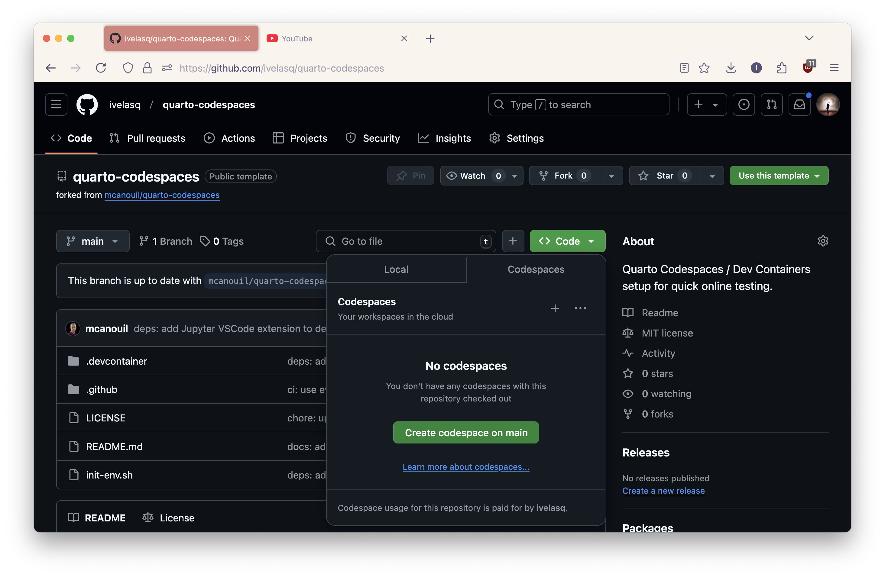
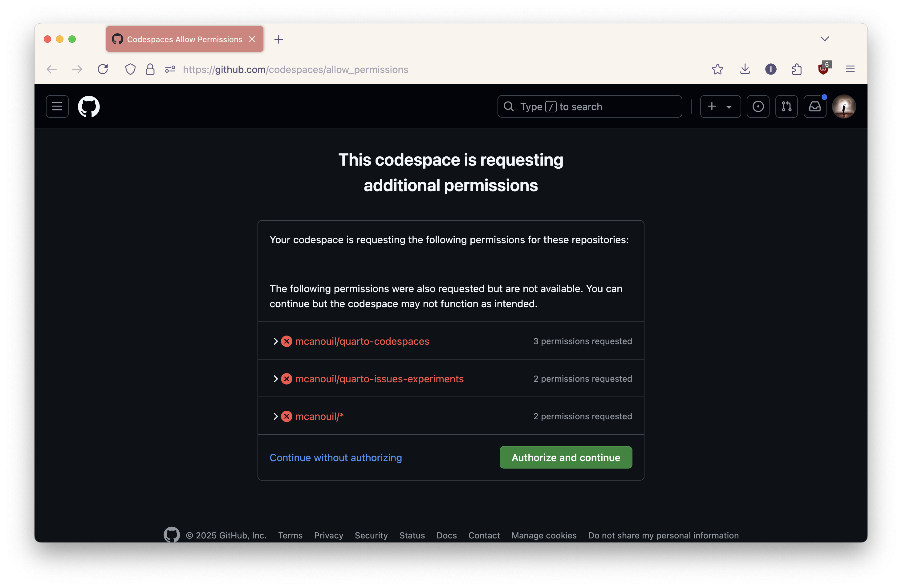
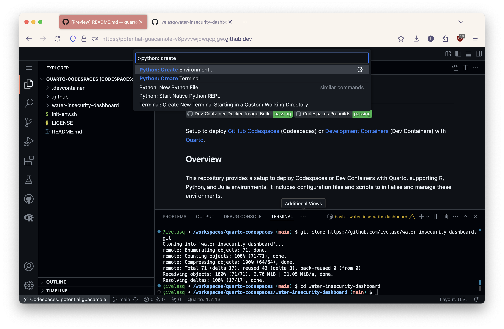
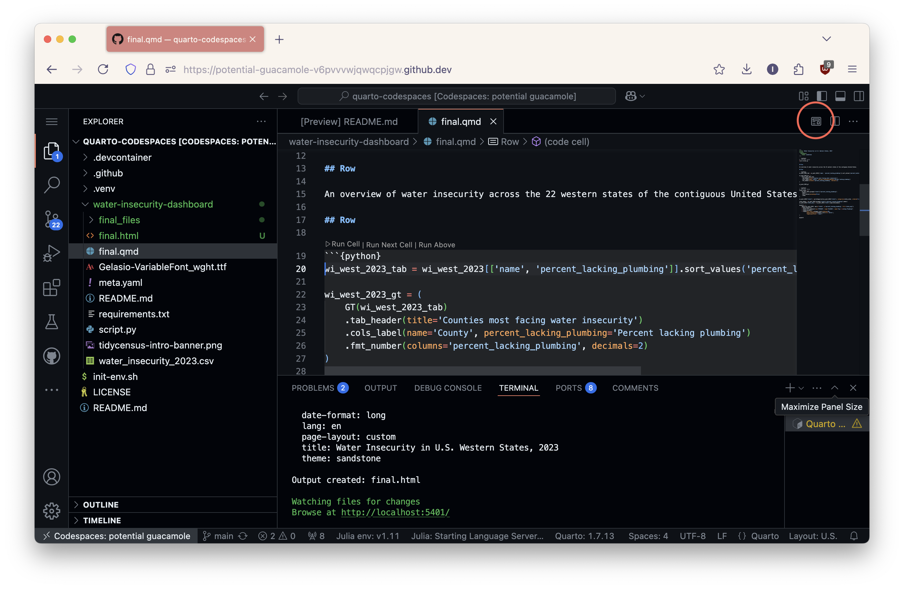
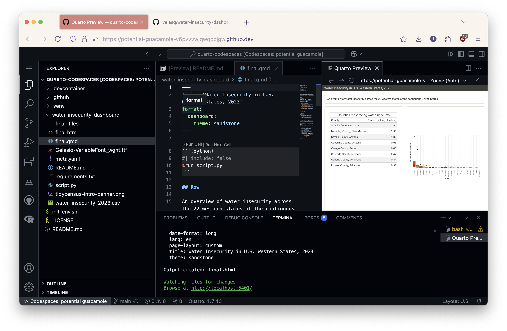

I recently received a question on [YouTube](https://www.youtube.com/watch?v=uLGe9zuuNl0) about running a Quarto project in GitHub Codespaces. This was new to me, so I did some research (thanks to [Mickaël Canouil](https://github.com/mcanouil) and others for their help!). The key takeaway is that everything needs to be containerized: Quarto, Jupyter, the Quarto extension, R, Python, etc. Simply installing the VS Code Quarto extension is not enough. The easiest way to achieve this is by using the [quarto-codespaces](https://github.com/mcanouil/quarto-codespaces) repository.

1.  Fork Mickaël's `quarto-codespaces` repo: <https://github.com/mcanouil/quarto-codespaces>
2.  Click the green "Code" button, select "Codespaces," and then "Create codespace on main."



3.  Click "Authorize" and continue. Creating the codespace may take a few minutes.



4.  Once the codespace is ready, clone your Quarto project into it. For example, to clone the `water-insecurity-dashboard` project, run the following in the terminal:

```bash
git clone https://github.com/ivelasq/water-insecurity-dashboard.git
```

5.  Navigate to the project directory: `cd water-insecurity-dashboard`

6.  Create a new Python environment. In the Command Palette (<kbd>Ctrl</kbd>+<kbd>Shift</kbd>+<kbd>P</kbd> or <kbd>Cmd</kbd>+<kbd>Shift</kbd>+<kbd>P</kbd>), select "Python: Create Environment...". Choose "Venv" and the appropriate Python interpreter. **Very importantly,** make sure you check the box to install dependencies from `requirements.txt`.



7.  Open your `.qmd` file (e.g., `final.qmd`) and click the "Preview" button in the top right.



That's it! Your Quarto project should now be running in GitHub Codespaces.


