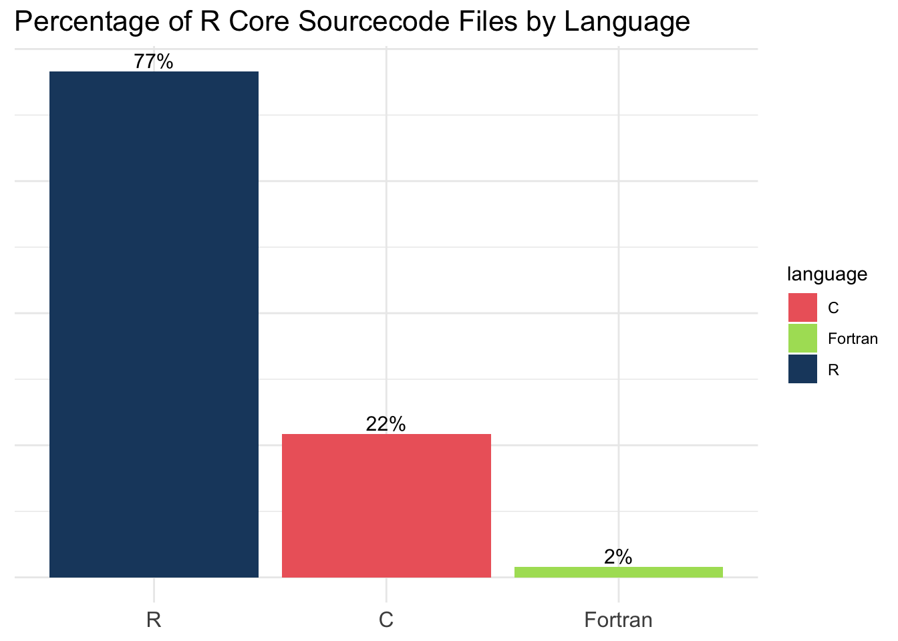

Cleaning out my computer as I get ready to switch to a new one has me running into old gems. So, when I say "Today I learned," I really mean "I learned this back in December 2021." 😅

Back then, I gave a talk at Why R? called 
[Packages for Using R With Python, Tableau, and Other Tools](https://www.youtube.com/watch?v=vyA2EiIz4pI&feature=youtu.be). One part of the talk was about how R itself isn't just made up of R. 

I adapted [this classic blog post](https://librestats.wordpress.com/2011/08/27/how-much-of-r-is-written-in-r/) by wrathematics to explore the composition of the [R 4.1.2 source package](https://cran.r-project.org/src/base/R-4/). The post features a script that scans the `.R`, `.c`, and `.f` files in the source, then records the language (R, C, or Fortran) and the number of lines of code in each language to a CSV file. Keep in mind, I have almost no knowledge of Shell (and this was pre-ChatGPT days!), so it took me a bit to adapt the original script from 2011.

```{.bash filename="shell.sh"}
outdir="./"

rdir="./R-4.1.2" #eg, ~/R-2.13.1/
cd $rdir/src

for rfile in `find . -type f -name *.R`
do
loc=`wc -l $rfile | sed -e 's/ ./,/' -e 's/\/[^/]*\//\//g' -e 's/\/[^/]*\//\//g' -e 's/\/[^/]*\///g' -e 's/\///'`
echo "R,$loc"  >> $outdir/r_source_loc.csv
done

for cfile in `find . -type f -name *.c`
do
loc=`wc -l $cfile | sed -e 's/ ./,/' -e 's/\/[^/]*\//\//g' -e 's/\/[^/]*\//\//g' -e 's/\/[^/]*\///g' -e 's/\///'`
echo "C,$loc"  >> $outdir/r_source_loc.csv
done

for ffile in `find . -type f -name *.f`
do
loc=`wc -l $ffile | sed -e 's/ ./,/' -e 's/\/[^/]*\//\//g' -e 's/\/[^/]*\//\//g' -e 's/\/[^/]*\///g' -e 's/\///'`
echo "Fortran,$loc"  >> $outdir/r_source_loc.csv
done
```

The script creates a file called `r_source_loc.csv`. It shows the number of lines by programming language by script in R 4.1.2. We can read it into R:


::: {.cell}

```{.r .cell-code}
library(dplyr)
library(stringr)

r_loc <-
  readr::read_table(here::here("til-r", "r-composition", "r_source_loc.csv"),
             col_names = c("language", "lines", "script")) |> 
  mutate(language = case_when(str_detect(language, "R,,") ~ "R",
                              str_detect(language, "C,,") ~ "C",
                              str_detect(language, "Fortran,,") ~ "Fortran"),
         lines = as.numeric(lines)) |> 
  distinct()

head(r_loc)
```

::: {.cell-output .cell-output-stdout}

```
# A tibble: 6 × 3
  language lines script        
  <chr>    <dbl> <chr>         
1 R           20 .snow2.RR     
2 R            9 .multicore3.RR
3 R           15 .multicore2.RR
4 R           10 .multicore1.RR
5 R           25 .RSeed.R      
6 R           36 .Master.R     
```


:::
:::


Now, we can visualize the percentage of R Core sourcecode files by language using ggplot2:


::: {.cell}

```{.r .cell-code}
library(ggplot2)
library(forcats)

r_loc |> 
  filter(!is.na(language)) |> 
  group_by(language) |> 
  summarise (n = n()) |> 
  mutate(rel.freq =  n / sum(n), accuracy = 0.1) |> 
  ggplot(aes(x = fct_reorder(language, desc(rel.freq)), y = rel.freq, fill = language)) +
  geom_bar(stat = "identity") +
  geom_text(
    aes(label = scales::percent(rel.freq)),
    position = position_dodge(width = 0.9),
    vjust = -0.25,
    size = 4
  ) +
  theme_minimal() +
  labs(title = "Percentage of R Core Sourcecode Files by Language") +
  theme(plot.title = element_text(size = 14),
        axis.title.x = element_blank(),
        axis.title.y = element_blank(),
        axis.text.x = element_text(size = 12),
        axis.text.y = element_blank()) +
  scale_fill_manual(values = c("R" = "#332288", 
                               "C" = "#882255", 
                               "Fortran" = "#44AA99"))
```

::: {.cell-output-display}
{width=672}
:::
:::


Or, we can visualize the percentage of R Core lines of code by language:


::: {.cell}

```{.r .cell-code}
r_loc |> 
  filter(!is.na(language)) |> 
  group_by(language) %>% 
  summarise(sum_lines = sum(lines, na.rm = TRUE)) |> 
  ungroup() |> 
  mutate(percent = sum_lines/sum(sum_lines)) |> 
  ggplot(aes(x = fct_reorder(language, desc(percent)), y = percent, fill = language)) +
  geom_bar(stat = "identity") +
  geom_text(
    aes(label = scales::percent(percent)),
    position = position_dodge(width = 0.9),
    vjust = -0.25,
    size = 4
  )+
  theme_minimal() +
  labs(title = "Percentage of R Core Lines of Code by Language") +
  theme(plot.title = element_text(size = 14),
        axis.title.x = element_blank(),
        axis.title.y = element_blank(),
        axis.text.x = element_text(size = 12),
        axis.text.y = element_blank(),
        legend.position = "none") +
  scale_fill_manual(values = c("R" = "#332288", 
                               "C" = "#882255", 
                               "Fortran" = "#44AA99"))
```

::: {.cell-output-display}
{width=672}
:::
:::


It’s interesting to see how much goes into making R what it is: an ecosystem built on collaboration across languages and tools (which was the takeaway from the talk!). If you’re curious about R's source code, give the script a shot!
